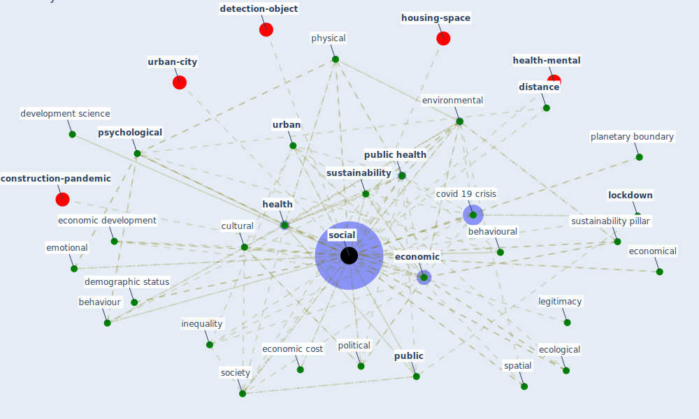

# Keyword: social

* [health-city](cluster_1)

* [space-housing](cluster_2)

* [iot-blockchain](cluster_4)

* [business-customer](cluster_7)

* [space-cid](cluster_11)

## Keywords

 * [5 g](keyword_5_g), adaptive, administrative pharmacy, adventure, ambient, behaviour, [behavioural](keyword_behavioural), biological, bond, building scientist, capital, class, [community](keyword_community), consumerist, [covid 19 crisis](keyword_covid_19_crisis), cross regional, cultural, demographic status, deprive, development science, [disease](keyword_disease), distance, [domain](keyword_domain), ecological, [economic](keyword_economic), economic aspect, economic barrier, economic benefit, economic consequence, economic cost, economic development, economic disruption, economic factor, economic force, economic function, economic impact, economic integrity, economic issue, economic life, economic well be, economical, [economy](keyword_economy), [ecosystem](keyword_ecosystem), emotional, employment policy, energy injustice, [entrepreneurship](keyword_entrepreneurship), [environmental](keyword_environmental), [epidemiological](keyword_epidemiological), [epidemiology](keyword_epidemiology), [europe](keyword_europe), face mask, fysisk, gender, [health](keyword_health), [healthcare](keyword_healthcare), hente, [human](keyword_human), inequality, intangible benefit, integration, [interaction](keyword_interaction), interconnect world, legitimacy, [lockdown](keyword_lockdown), normative, [pandemic](keyword_pandemic), pharmacy, [physical](keyword_physical), planetary boundary, [policy](keyword_policy), political, poverty, [psychological](keyword_psychological), [public](keyword_public), [public health](keyword_public_health), [public housing](keyword_public_housing), [public space](keyword_public_space), recreational, [research](keyword_research), resiliece, retail servicescape, sanitary, sensory, [social](keyword_social), [society](keyword_society), spatial, stay at home, sundhe, [sustainability](keyword_sustainability), sustainability pillar, sustainable bond, territorial, [urban](keyword_urban), urban society, value, wealth, web site, [well be](keyword_well_be), [wellbee](keyword_wellbee)

## Mapping

## Neighbours

### Closest articles

* How COVID-19 Could Accelerate the Adoption of New Retail Technologies and Enhance the (E-)Servicescape - [LINK](article_willems_how_2021)
* World Bank Development Report - [LINK](article_world_bank_world_2022)
* Urban planning after COVID-19 - [LINK](article_rtpi_urban_2021)
* COVID-19 and the UN Sustainable Development Goals: Threat to Solidarity or an Opportunity? - [LINK](article_leal_filho_covid-19_2020)
* COVID-ABS: An agent-based model of COVID-19 epidemic to simulate health and economic effects of social distancing interventions - [LINK](article_silva_covid-abs_2020)
* Addressing vulnerability, building resilience: community-based adaptation to vector-borne diseases in the context of global change - [LINK](article_bardosh_addressing_2017)
* The role of green roofs in post COVID-19 confinement: An analysis of willingness to pay - [LINK](article_manso_role_2021)
* Ten questions concerning occupant health in buildings during normal operations and extreme events including the COVID-19 pandemic - [LINK](article_awada_ten_2021)
* Readiness Assessment of Green Building Certification Systems for Residential Buildings during Pandemics - [LINK](article_tleuken_readiness_2021)
* The City Under COVID‐19: Podcasting As Digital Methodology - [LINK](article_rogers_city_2020)

### Closest BPs

