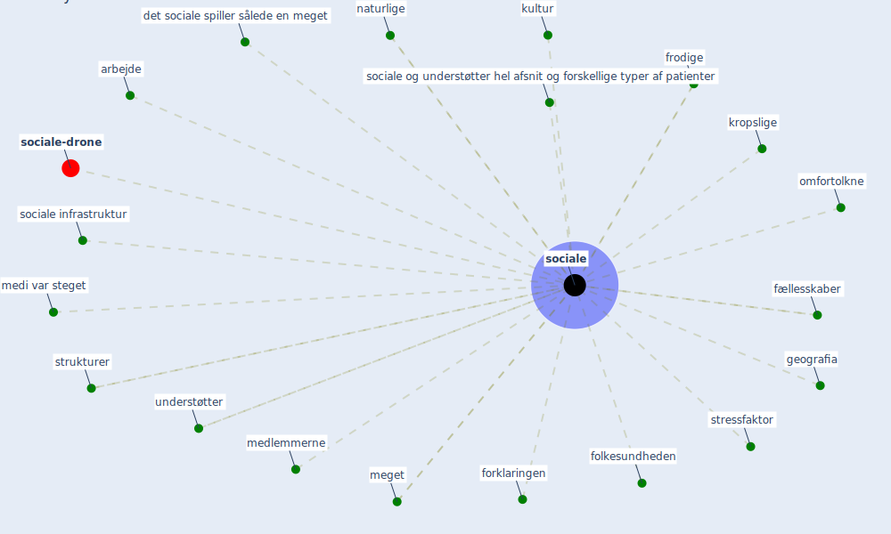

# Keyword: sociale

* [sociale-drone](cluster_6)

## Keywords

 * Cluster_6, arbejde, det sociale spiller sålede en meget, folkesundheden, forklaringen, frodige, fællesskaber, geografia, kropslige, kultur, medi var steget, medlemmerne, meget, naturlige, omfortolkne, [sociale](keyword_sociale), sociale infrastruktur, sociale og understøtter hel afsnit og forskellige typer af patienter, stressfaktor, strukturer, understøtter

## Mapping

## Neighbours

### Closest articles

* Refleksioner fra en pandemi - [LINK](article_realdania_refleksioner_2022)
* Pandemiens arkitektur - [LINK](article_realdania_pandemiens_2022)
* Proximity and post-COVID-19 urban development: Reflections from Milan, Italy - [LINK](article_tricarico_proximity_2021)

### Closest BPs

