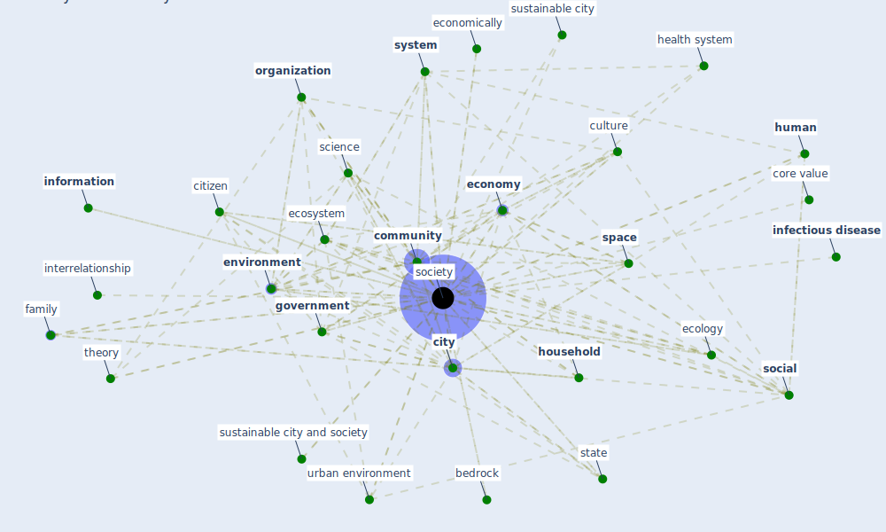

# Keyword: society

## Keywords

 * affluent, affluent segment, [agent](keyword_agent), aspiration, authoritarian, bedrock, behavior, [big datum](keyword_big_datum), board of director, [business](keyword_business), citizen, [city](keyword_city), civil construction, civilization, collapse of one of the three pillar, collective psyche, comment, [community](keyword_community), [company](keyword_company), [computer](keyword_computer), constitution, consumer society, context, context orient, core value, [country](keyword_country), [covid 19 pandemic](keyword_covid_19_pandemic), culture, diversity of the society, ecology, [economic](keyword_economic), economic status, economically, [economy](keyword_economy), [ecosystem](keyword_ecosystem), [environment](keyword_environment), extractive industry, family, family formation, food chain, future, future generation, [government](keyword_government), grassroots organization, [health](keyword_health), [health and safety](keyword_health_and_safety), health and well be, [health system](keyword_health_system), [household](keyword_household), housing market, [human](keyword_human), ideology, individual, inequality, [infectious disease](keyword_infectious_disease), [information](keyword_information), interrelationship, [labour market](keyword_labour_market), layer, layer s, main element, new climate, [organization](keyword_organization), [population](keyword_population), primary service, [public](keyword_public), public good, [public health](keyword_public_health), public medium, [public place](keyword_public_place), [resilience](keyword_resilience), safe, science, scientific role, [sector](keyword_sector), self organization, [smart city](keyword_smart_city), [social](keyword_social), socially, societies, [society](keyword_society), socioeconomic, [space](keyword_space), [stakeholder](keyword_stakeholder), [state](keyword_state), [surveillance](keyword_surveillance), [sustainable](keyword_sustainable), sustainable city, sustainable city and society, [system](keyword_system), target layer, technology in society, technology trend, the environment, the guardian, theory, three pillar, urban environment, [vulnerability](keyword_vulnerability), vulnerable

## Mapping

## Neighbours

### Closest articles

* Guidelines for resilience systems analysis - [LINK](article_oecd_guidelines_2014)
* Treating two pandemics for the price of one: Chronic and infectious disease impacts of the built and natural environment - [LINK](article_frank_treating_2021)
* Towards Resilient Residential Buildings and Neighborhoods in Light of COVID-19 Pandemic—The Scenario of Podgorica, Montenegro - [LINK](article_bojovic_towards_2022)
* 10 Adaptive Measures for Public Places to face the COVID 19 Pandemic Outbreak - [LINK](article_cheshmehzangi_10_2020)
* Preparing critical infrastructure for the future: Lessons learnt from the Covid-19 pandemic - [LINK](article_tomalska_preparing_2022)
* Social distancing enhanced automated optimal design of physical spaces in the wake of the COVID-19 pandemic - [LINK](article_ugail_social_2021)
* Learning from pandemics: Applying resilience thinking to identify priorities for planning urban settlements - [LINK](article_syal_learning_2021)
* Sustainable work throughout the life course: National policies and strategies, Publications Office of the European Union - [LINK](article_eurofund_sustainable_2016)
* How COVID-19 Redefines the Concept of Sustainability - [LINK](article_hakovirta_how_2020)
* Navigating Climate Change: Rethinking the Role of Buildings - [LINK](article_cole_navigating_2020)

### Closest BPs

