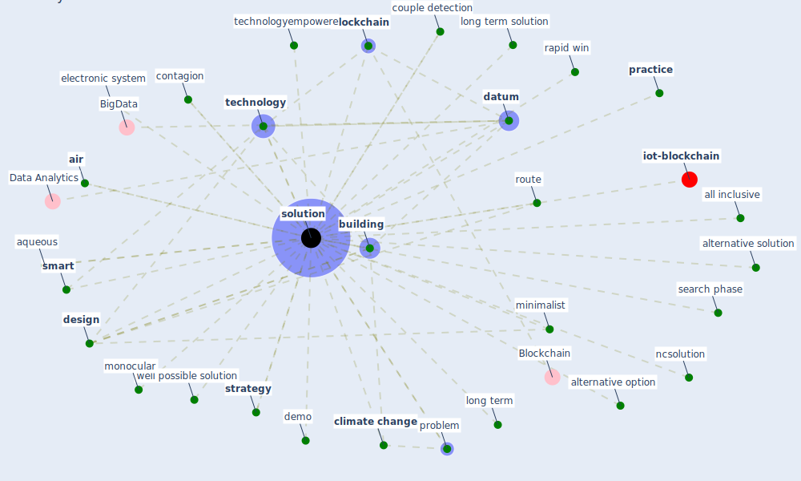

# Keyword: solution

* [ontology-datum](cluster_12)

## Keywords

 * 3d, 3d view, Cluster_12, [air](keyword_air), all inclusive, alternative option, alternative solution, aqueous, aqueous phase, automation, [blockchain](keyword_blockchain), [build](keyword_build), [building](keyword_building), [chromosome](keyword_chromosome), [climate change](keyword_climate_change), contagion, couple detection, [datum](keyword_datum), datum analytic, demo, demo e not at all, [design](keyword_design), electronic system, [formaldehyde](keyword_formaldehyde), good approach, government intervention, long term, long term solution, minimalist, mobile technology, monocular, monocular solution, [nature](keyword_nature), nature base, nature base solution, ncsolution, one solution, online education, optimal, optimize, plug and play, practice, problem, rapid win, [route](keyword_route), science base evidence, search phase, [smart](keyword_smart), smart fleet management, [solution](keyword_solution), solution to this problem, solutions, strategy, [sustainability](keyword_sustainability), [technology](keyword_technology), technology drive, technologyempowere, tinker, well possible, well possible solution

## Mapping

## Neighbours

### Closest articles

* COVID-19 Could Leverage a Sustainable Built Environment - [LINK](article_pinheiro_covid-19_2020)
* How COVID-19 Could Accelerate the Adoption of New Retail Technologies and Enhance the (E-)Servicescape - [LINK](article_willems_how_2021)
* Mechanisms for addressing the impact of COVID-19 on infrastructure projects - [LINK](article_king_mechanisms_2021)
* Coronavirus questions that will not go away: interrogating urban and socio-spatial implications of COVID-19 measures - [LINK](article_salama_coronavirus_2020)
* COVID19-Routes: A Safe Pedestrian Navigation Service - [LINK](article_cantarero_covid19-routes_2021)
* Contributions of Smart City Solutions and Technologies to Resilience against the COVID-19 Pandemic: A Literature Review - [LINK](article_sharifi_contributions_2021)
* DeepSOCIAL: Social Distancing Monitoring and Infection Risk Assessment in COVID-19 Pandemic - [LINK](article_rezaei_deepsocial_2020)
* Towards Resilient Residential Buildings and Neighborhoods in Light of COVID-19 Pandemic—The Scenario of Podgorica, Montenegro - [LINK](article_bojovic_towards_2022)
* Methods for air cleaning and protection of building occupants from airborne pathogens - [LINK](article_bolashikov_methods_2009)
* Designing Post COVID-19 Buildings: Approaches for Achieving Healthy Buildings - [LINK](article_navaratnam_designing_2022)

### Closest BPs

