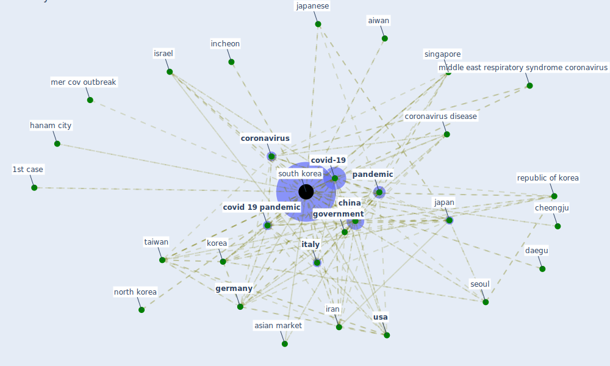

# Keyword: south korea

## Keywords

 * 1st case, 2015 mer crisis, aiwan, [artificial intelligence](keyword_artificial_intelligence), asian market, bank efficiency, call center, [cctv](keyword_cctv), cheongju, [china](keyword_china), [coronavirus](keyword_coronavirus), coronavirus disease, coronavirus disease outbreak, coronavirus disease outbreak in call center, coronavirus diseaseoutbreak in call center, coronavirus lockdown, [country](keyword_country), covid 19 outbreak, [covid 19 pandemic](keyword_covid_19_pandemic), covid 19stdoutoutbreak, [covid-19](keyword_covid-19), cross cultural, daegu, develop country, dzuroska f coronavirus, eurasian geogr, first case, [germany](keyword_germany), [government](keyword_government), government of south korea, hanam, hanam city, [hospital](keyword_hospital), incheon, iran, israel, [italy](keyword_italy), its first case, [japan](keyword_japan), japanese, [korea](keyword_korea), mer cov outbreak, middle east respiratory syndrome coronavirus, new aiir, north korea, [outbreak](keyword_outbreak), [pandemic](keyword_pandemic), pandemic control, pandemic control in place, [quarantine](keyword_quarantine), recent outbreak, republic of korea, [seoul](keyword_seoul), seoul of alonso, singapore, situation in china, [sme](keyword_sme), [south korea](keyword_south_korea), system effectiveness of detection brief intervention, [taiwan](keyword_taiwan), tertiary care hospital, the pandemic, the seoul of alonso, tracking psynetsystem, traffic level, uae 5, [united kingdom](keyword_united_kingdom), [usa](keyword_usa)

## Mapping

## Neighbours

### Closest articles

* Pandemic Analytics: How Countries are Leveraging Big Data Analytics and Artificial Intelligence to Fight COVID-19? - [LINK](article_mehta_pandemic_2021)
* Contributions of Smart City Solutions and Technologies to Resilience against the COVID-19 Pandemic: A Literature Review - [LINK](article_sharifi_contributions_2021)
* Rapid expansion of temporary, reliable airborne-infection isolation rooms with negative air machines for critical COVID-19 patients - [LINK](article_lee_rapid_2020)
*  - [LINK](article_mehtab_alam_role_2021)
*  - [LINK](article_huy-tran_design_2022)
* A Comprehensive Review of the COVID-19 Pandemic and the Role of IoT, Drones, AI, Blockchain, and 5G in Managing its Impact - [LINK](article_chamola_comprehensive_2020)
* Association of built environment attributes with the spread of COVID-19 at its initial stage in China - [LINK](article_li_association_2021)
* Future (post-COVID) digital, smart and sustainable cities in the wake of 6G: Digital twins, immersive realities and new urban economies - [LINK](article_allam_future_2021)
* Open-source analytics tools for studying the COVID-19 coronavirus outbreak - [LINK](article_wu_open-source_2020)
* Effects of temperature and humidity on the spread of COVID-19: A systematic review - [LINK](article_mecenas_effects_2020)

### Closest BPs

