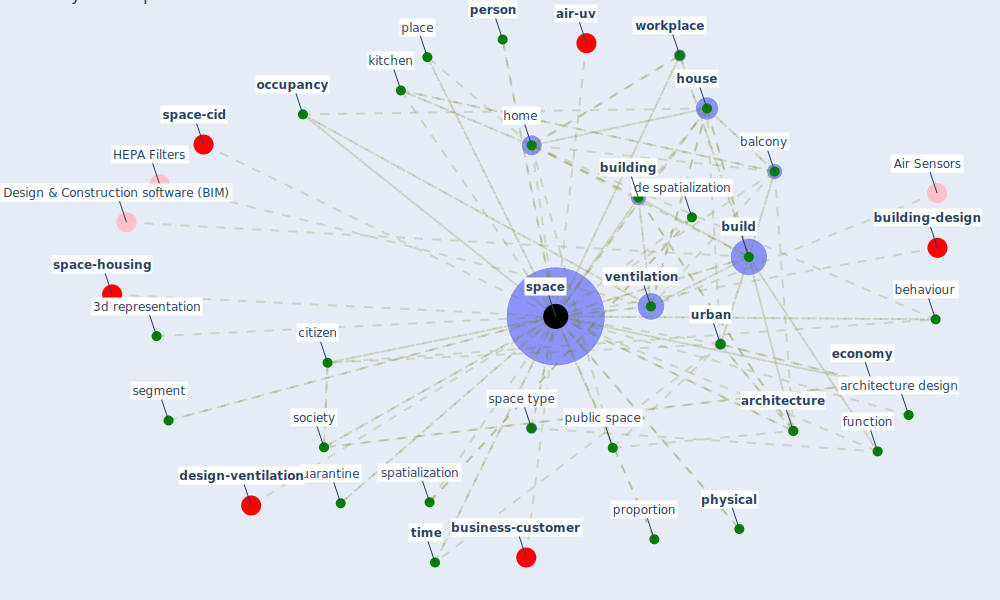

# Keyword: space

* [urban-city](cluster_6)

* [air-sars](cluster_9)

* [housing-space](cluster_14)

## Keywords

 * 3d model, 3d representation, Cluster_14, Cluster_6, Cluster_9, accessible surface, [architecture](keyword_architecture), architecture design, attention, [balcony](keyword_balcony), [bedroom](keyword_bedroom), behaviour, [build](keyword_build), [building](keyword_building), building parameter, [case](keyword_case), case for space, changeable space, citizen, [city](keyword_city), city area, communication, [community](keyword_community), community space, community space development, concept, [constraint](keyword_constraint), context, [de spatialization](keyword_de_spatialization), dennistoun, door, earth, [economy](keyword_economy), efficiency, emergency, energy cost, environment and plan a, existence maximum, existence minimum, [flex space](keyword_flex_space), floor, floor texture, function, [home](keyword_home), [house](keyword_house), ieq condition, [indoor](keyword_indoor), isolation, isolation space, kitchen, new home, [object](keyword_object), occupancy, occupancy management, [occupant](keyword_occupant), [office](keyword_office), open air, [organisation](keyword_organisation), outlet, person, [physical](keyword_physical), [place](keyword_place), placemake, poe scope, poe scope of work, [privacy](keyword_privacy), proportion, public building, [public space](keyword_public_space), public space network, restroom, rooftop, [room](keyword_room), segment, sense, sense of place, [society](keyword_society), [space](keyword_space), space can do so, space index, space type, spaces, spacetime, spacing, spatial, spatialization, [supply](keyword_supply), syntax, terrace, think, think about, time, transportation, uarantine, [urban](keyword_urban), vegetation, [ventilation](keyword_ventilation), welcome the light, [workplace](keyword_workplace), floor

## Mapping

## Neighbours

### Closest articles

* Architectural Design Drives the Biogeography of Indoor Bacterial Communities - [LINK](article_kembel_architectural_2014)
* Designing a Multi-Agent Occupant Simulation System to Support Facility Planning and Analysis for COVID-19 - [LINK](article_lee_designing_2021)
* How the Coronavirus Will Reshape Architecture - [LINK](article_chayka_how_2020)
* The Impact of COVID-19 on Public Space: A Review of the Emerging Questions - [LINK](article_honey-roses_impact_2020)
* Adaptive Design of the Built Environment to Mitigate the Transmission Risk of COVID-19 - [LINK](article_ara_dilshad_shangi_adaptive_2020)
* Health, Wellbeing \& Productivity in Offices - [LINK](article_world_green_building_council_health_2014)
* Urban Community Sustainable Development Patterns under the Influence of COVID-19: A Case Study Based on the Non-Contact Interaction Perspective of Hangzhou City - [LINK](article_wang_urban_2021)
* A Mixed Approach on Resilience of Spanish Dwellings and Households during COVID-19 Lockdown - [LINK](article_cuerdo-vilches_mixed_2020)
* Towards Resilient Residential Buildings and Neighborhoods in Light of COVID-19 Pandemic—The Scenario of Podgorica, Montenegro - [LINK](article_bojovic_towards_2022)
* Mobile Technology Solution for COVID-19: Surveillance and Prevention - [LINK](article_raza_mobile_2021)

### Closest BPs

