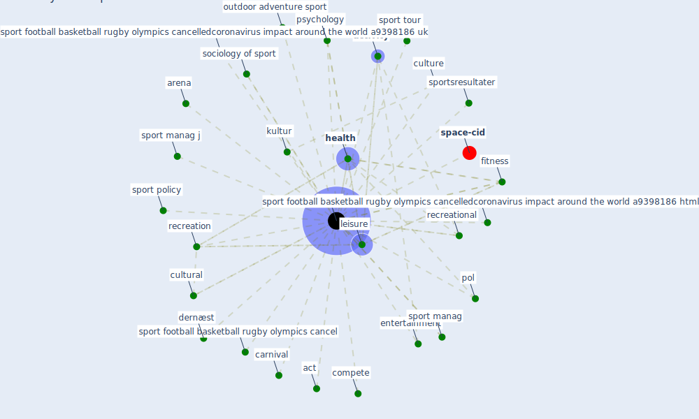

# Keyword: sport

* [space-cid](cluster_2)

## Keywords

 * Cluster_2, act, [activity](keyword_activity), arena, carnival, compete, cultural, culture, dernæst, entertainment, event, exerc j, fitness, [health](keyword_health), kultur, leisure, outdoor adventure, outdoor adventure sport, pol, polo, psychology, recreation, recreational, sociology of sport, [sport](keyword_sport), sport football basketball rugby olympics cancel, sport football basketball rugby olympics cancelledcoronavirus impact around the world a9398186 html, sport football basketball rugby olympics cancelledcoronavirus impact around the world a9398186 uk, sport manag, sport manag j, sport policy, sport tour, sporting, sports, sportsresultater

## Mapping

## Neighbours

### Closest articles

* Assessment of COVID-19 precautionary measures in sports facilities: A case study on a health club in Saudi Arabia - [LINK](article_ibrahim_assessment_2022)
* A Mixed Approach on Resilience of Spanish Dwellings and Households during COVID-19 Lockdown - [LINK](article_cuerdo-vilches_mixed_2020)
* Urban Community Sustainable Development Patterns under the Influence of COVID-19: A Case Study Based on the Non-Contact Interaction Perspective of Hangzhou City - [LINK](article_wang_urban_2021)
* Refleksioner fra en pandemi - [LINK](article_realdania_refleksioner_2022)
* Prophylactic Architecture: Formulating the Concept of Pandemic-Resilient Homes - [LINK](article_elrayies_prophylactic_2022)
* The socio-economic implications of the coronavirus pandemic (COVID-19): A review - [LINK](article_nicola_socio-economic_2020)
* Design COVID-19 Ontology: A Healthcare and Safety Perspective - [LINK](article_aloulou_design_2022)
* The socio-economic determinants of COVID-19: A spatial analysis of German county level data - [LINK](article_ehlert_socio-economic_2021)
* How the 5G Enabled the COVID-19 Pandemic Prevention and Control: Materiality, Affordance, and (De-)Spatialization - [LINK](article_li_how_2022)
* Seeing the invisible hand: Underlying effects of COVID-19 on tourists’ behavioral patterns - [LINK](article_li_seeing_2020)

### Closest BPs

