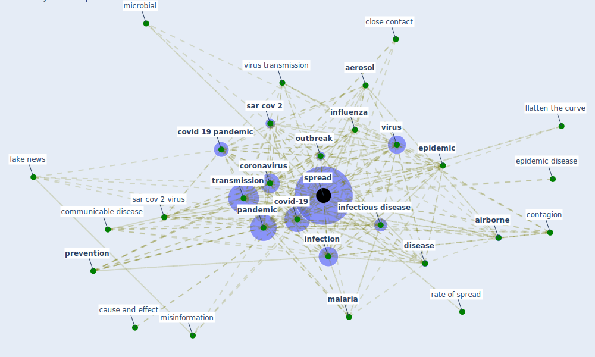

# Keyword: spread

* [health-city](cluster_1)

* [design-ventilation](cluster_10)

* [air-uv](cluster_12)

## Keywords

 * 15 day, 2015 avian influenza, Cluster_1, Cluster_10, acceleration phase, [aerosol](keyword_aerosol), [airborne](keyword_airborne), basis point, cause and effect, change in behaviour, chaotic movement, chaotic movement of people, close contact, close contact between person, coivd 19, communicable disease, computer virus, computer viruse, construction site, [contact](keyword_contact), contact time, contact with contaminated surface, contagion, contaminate surface, [control](keyword_control), [coronavirus](keyword_coronavirus), covid 19 outbreak, covid 19 outbreak in china, [covid 19 pandemic](keyword_covid_19_pandemic), [covid-19](keyword_covid-19), demographic science, [disease](keyword_disease), disease diffusion, disease transmission, ebola, [epidemic](keyword_epidemic), epidemic disease, [epidemiological](keyword_epidemiological), [fake news](keyword_fake_news), false information, false news, flatten the curve, human to human transmission, [impact](keyword_impact), implication, [infect](keyword_infect), [infection](keyword_infection), [infectious disease](keyword_infectious_disease), infectious virus, [influenza](keyword_influenza), institution, low income country, [malaria](keyword_malaria), [microbial](keyword_microbial), [misinformation](keyword_misinformation), misinformation online, model ap proache, [ontology](keyword_ontology), [outbreak](keyword_outbreak), [pandemic](keyword_pandemic), person to person, population density, precipitation, [prediction](keyword_prediction), prevent carriage, prevent the spread of disease, [prevention](keyword_prevention), promoter of spread, public health protocol, rapidity, rate of spread, relocation diffusion, respiratory droplet, respiratory infection, respiratory virus, restrict human mobility, ride sharing system, [risk](keyword_risk), safely dispose, [sar cov 2](keyword_sar_cov_2), sar cov 2 virus, sars mers covid 19, seasonality, secondary market, secondary transmission, significant, [simulation](keyword_simulation), [spread](keyword_spread), stage, [technology](keyword_technology), the pandemic, [transmission](keyword_transmission), transmission route, [vector borne disease](keyword_vector_borne_disease), [ventilation](keyword_ventilation), [viral](keyword_viral), virulent disease, [virus](keyword_virus), virus transmission, widespread disease

## Mapping

## Neighbours

### Closest articles

* The Socio-Spatial Determinants of COVID-19 Diffusion: The Impact of Globalisation, Settlement Characteristics and Population - [LINK](article_sigler_socio-spatial_2020)
* Understanding the role of urban design in disease spreading - [LINK](article_brizuela_understanding_2019)
* Association of built environment attributes with the spread of COVID-19 at its initial stage in China - [LINK](article_li_association_2021)
* A critical review of heating, ventilation, and air conditioning (HVAC) systems within the context of a global SARS-CoV-2 epidemic - [LINK](article_elsaid_critical_2021)
* Effects of temperature and humidity on the spread of COVID-19: A systematic review - [LINK](article_mecenas_effects_2020)
* Mobile Technology Solution for COVID-19: Surveillance and Prevention - [LINK](article_raza_mobile_2021)
* Coronavirus questions that will not go away: interrogating urban and socio-spatial implications of COVID-19 measures - [LINK](article_salama_coronavirus_2020)
* Impact of Covid-19 on the built environment - [LINK](article_mahima_impact_2022)
* A Review on Building Design as a Biomedical System for Preventing COVID-19 Pandemic - [LINK](article_amran_review_2022)
* Respiratory pandemics, urban planning and design: A multidisciplinary rapid review of the literature - [LINK](article_harris_respiratory_2022)

### Closest BPs

