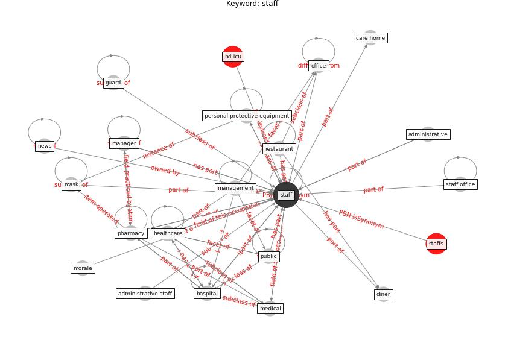

# Keyword: staff

* [ward-patient](cluster_Cluster_15)

## Keywords

 * Cluster_15, administrative, administrative staff, care home, competency, diner, guard, [healthcare](keyword_healthcare), [hospital](keyword_hospital), management, [manager](keyword_manager), [mask](keyword_mask), [medical](keyword_medical), morale, [news](keyword_news), [office](keyword_office), [personal protective equipment](keyword_personal_protective_equipment), pharmacy, [public](keyword_public), restaurant, [staff](keyword_staff), staff office, staffs

## Concepts

 

## Neighbours

### Closest articles

* How COVID-19 Could Accelerate the Adoption of New Retail Technologies and Enhance the (E-)Servicescape - [LINK](article_willems_how_2021)
* COVID-19 Forced Hospitals to Build Negative Pressure Rooms Fast - [LINK](article_dyer_covid-19_2020)
* Management of the COVID-19 pandemic: challenges, practices, and organizational support - [LINK](article_hossny_management_2022)
* Assessment of COVID-19 precautionary measures in sports facilities: A case study on a health club in Saudi Arabia - [LINK](article_ibrahim_assessment_2022)
* COVID-19: A new digital dawn? - [LINK](article_robbins_covid-19_2020)
* SARS-CoV-2 RNA detection of hospital isolation wards hygiene monitoring during the Coronavirus Disease 2019 outbreak in a Chinese hospital - [LINK](article_wang_sars-cov-2_2020)
* Leveraging Digital Transformation Technologies to Tackle COVID-19: Proposing a Privacy-First Holistic Framework - [LINK](article_arpaci_leveraging_2021)
* Designing a Multi-Agent Occupant Simulation System to Support Facility Planning and Analysis for COVID-19 - [LINK](article_lee_designing_2021)
* Contributions of Smart City Solutions and Technologies to Resilience against the COVID-19 Pandemic: A Literature Review - [LINK](article_sharifi_contributions_2021)

### Closest BPs

