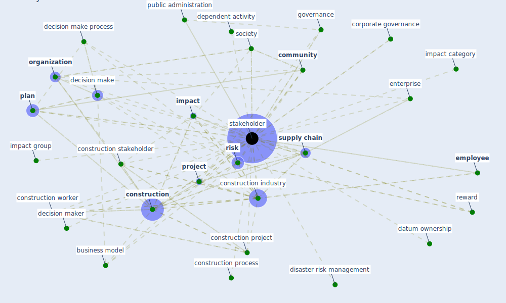

# Keyword: stakeholder

## Keywords

 * [analysis](keyword_analysis), build design professional, build professional, business model, citizen, [community](keyword_community), [construction](keyword_construction), construction company, [construction industry](keyword_construction_industry), construction process, construction project, construction stakeholder, [construction worker](keyword_construction_worker), corporate governance, [customer](keyword_customer), datum exchange, datum ownership, decision make, decision make process, decision maker, dependent, dependent activity, disaster risk management, east africa, [employee](keyword_employee), [engineer](keyword_engineer), enterprise, governance, [impact](keyword_impact), impact category, impact group, issue, layer of society, [organisation](keyword_organisation), [organization](keyword_organization), participatory form of governance, [plan](keyword_plan), [project](keyword_project), [public administration](keyword_public_administration), regulatory agency, reward, [risk](keyword_risk), [social](keyword_social), [society](keyword_society), [stakeholder](keyword_stakeholder), stakeholders, subcontractor, supplier, [supply chain](keyword_supply_chain)

## Mapping

## Neighbours

### Closest articles

* Influence between COVID-19 Impacts and Project Stakeholders in Chilean Construction Projects - [LINK](article_araya_influence_2021)
* Guidelines for resilience systems analysis - [LINK](article_oecd_guidelines_2014)
* How COVID-19 Could Accelerate the Adoption of New Retail Technologies and Enhance the (E-)Servicescape - [LINK](article_willems_how_2021)
* Navigating Climate Change: Rethinking the Role of Buildings - [LINK](article_cole_navigating_2020)
* Propositions for a Resilient, Post-COVID-19 Future for the AEC Industry - [LINK](article_nassereddine_propositions_2021)
* Learning from the COVID-19 pandemic in governing smart cities - [LINK](article_bolivar_learning_2022)
* Amplifying the role of knowledge translation platforms in the COVID-19 pandemic response - [LINK](article_el-jardali_amplifying_2020)
* A critical analysis of the impacts of COVID-19 on the global economy and ecosystems and opportunities for circular economy strategies - [LINK](article_ibn-mohammed_critical_2021)
* Assessment method for new sustainability indicators providing pandemic resilience for residential buildings - [LINK](article_tokazhanov_assessment_2021)
* The Impact of Pandemic Crisis on the Survival of Construction Industry: A Case of COVID-19 - [LINK](article_gamil_impact_2020)

### Closest BPs

