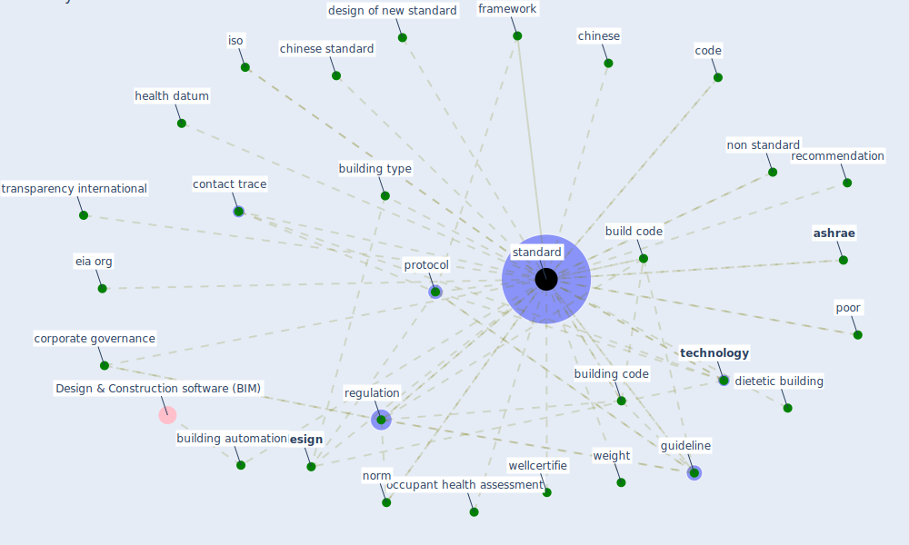

# Keyword: standard

## Keywords

 * application programming interface, [ashrae](keyword_ashrae), ashrae 55 2004, ashrae standard 90 1, [build](keyword_build), build code, build design guideline, building automation, building code, building code and standard trend, building type, cen, cgc, [chinese](keyword_chinese), chinese standard, code, code requirement, contact trace, corporate governance, [design](keyword_design), design of new standard, dietetic building, dysfunctional, eia org, [energy efficiency](keyword_energy_efficiency), framework, guide, guide line, guideline, health datum, [housing](keyword_housing), icr, interoperability, iso, legislation, legislative guideline, loan quality, loinc, metadata, multi story housing, new economic environment, non standard, norm, npl, objective, occupant health assessment, occupant health assessment standard, [pandemic](keyword_pandemic), poor, prepandemic, [protocol](keyword_protocol), recommendation, regulation, regulatory, semantic web, sf, [standard](keyword_standard), standard 62 2 2013, standard deviation, standard din, standards, subcontract, subcontract agreement, supervision, [technology](keyword_technology), transparency international, weight, wellcertifie

## Mapping

## Neighbours

### Closest articles

* Ten questions concerning occupant health in buildings during normal operations and extreme events including the COVID-19 pandemic - [LINK](article_awada_ten_2021)
* An Intelligent IEQ Monitoring and Feedback System: Development and Applications - [LINK](article_geng_intelligent_2021)
* How will COVID-19 change future building regulations? - [LINK](article_hmc_architects_how_2020)
* World Bank Development Report - [LINK](article_world_bank_world_2022)
* Navigating Climate Change: Rethinking the Role of Buildings - [LINK](article_cole_navigating_2020)
* Assessment of Building Automation and Control Systems in Danish Healthcare Facilities in the COVID-19 Era - [LINK](article_pedersen_assessment_2022)
* Challenges of data sharing in European Covid-19 projects: A learning opportunity for advancing pandemic preparedness and response - [LINK](article_tacconelli_challenges_2022)
* Readiness Assessment of Green Building Certification Systems for Residential Buildings during Pandemics - [LINK](article_tleuken_readiness_2021)
* Indoor Air Quality: Rethinking rules of building design strategies in post-pandemic architecture - [LINK](article_megahed_indoor_2021)
* COVID-19 and Green Housing: A Review of Relevant Literature - [LINK](article_kaklauskas_covid-19_2021)

### Closest BPs

