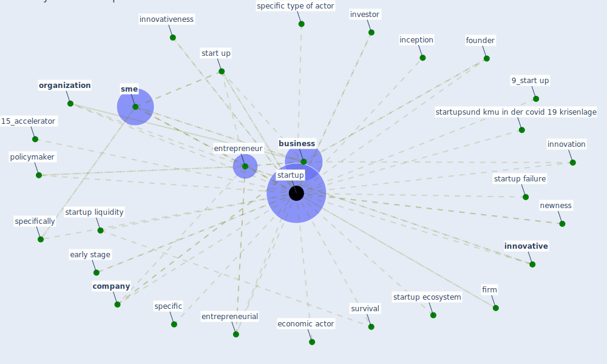

# Keyword: startup

## Keywords

 * 15_accelerator, 6_startup, 9_start up, [application](keyword_application), [business](keyword_business), business model, [company](keyword_company), [covid 19 crisis](keyword_covid_19_crisis), early stage, [economic](keyword_economic), economic activity, economic actor, economic life, [economy](keyword_economy), enterprise, [entrepreneur](keyword_entrepreneur), entrepreneurial, first policy support service, founder, growth, inception, [innovation](keyword_innovation), innovation potential, [innovative](keyword_innovative), innovativeness, investor, large more establish firm, nabta health, newness, [organization](keyword_organization), [policy](keyword_policy), policymaker, [sme](keyword_sme), software, specific, specific type of actor, specifically, start up, start up support, [startup](keyword_startup), startup ecosystem, startup failure, startup liquidity, startup specific, startups, startupsund kmu in der covid 19 krisenlage, survival, the covid 19 crisis, venture capital, firm

## Mapping

## Neighbours

### Closest articles

* Startups in times of crisis – A rapid response to the COVID-19 pandemic - [LINK](article_kuckertz_startups_2020)
* Health, Wellbeing \& Productivity in Offices - [LINK](article_world_green_building_council_health_2014)
* Pandemic Analytics: How Countries are Leveraging Big Data Analytics and Artificial Intelligence to Fight COVID-19? - [LINK](article_mehta_pandemic_2021)

### Closest BPs

