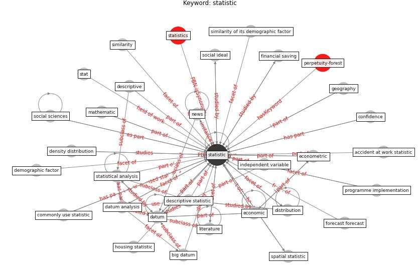

# Keyword: statistic

* [perpetuity-forest](cluster_Cluster_6)

## Keywords

 * 95 confidence level, accident at work statistic, [algorithm](keyword_algorithm), annal, annal of apply statistic, authority, bank statistic, [big datum](keyword_big_datum), chun chen, civilian unemployment rate, commonly use statistic, [construction industry](keyword_construction_industry), confidence, coronavirus trust news source by we, coronavirus trust news source by we 37, covid 19 infection rate, covid 19 pandemic in mainland china, [datum](keyword_datum), datum analysis, datum science, datum source, day, death, demographic factor, demography, density distribution, descriptive, descriptive statistic, dimension reduction, distribution, econometric, [economic](keyword_economic), empirical social research, [energy consumption](keyword_energy_consumption), financial saving, forecast forecast, frame, geography, [government](keyword_government), [health and safety](keyword_health_and_safety), housing statistic, [impact](keyword_impact), independent variable, information, likert, linear regression model, literature, log transform, material and method, mathematic, national statistic, [news](keyword_news), number of smartphone user worldwide, [nursing](keyword_nursing), odd ratio, official statistic, oxford town centre dataset, performance statistic, poisson distribution, population variable, programme implementation, quar terly, random parameter, raw datum, [research](keyword_research), safe route, secondary research, settlement characteristic, short route, significance, significance level, similarity, similarity of its demographic factor, social ideal, social research, social sciences, spatial distribution, spatial statistic, springer series, standard deviation, stat, statal map, [statistic](keyword_statistic), statistical analysis, statistics, subgraph, swiss journal of economic, t test, telecommunication, telecommunication datum, the number of death, the number of death remain low and decline, turnstile usage, two way anova, uk statistic, [united kingdom](keyword_united_kingdom), variance, woman s datum, world health organization, worldwide infection rate of major virus outbreak

## Concepts

 

## Neighbours

### Closest articles

* The socio-economic determinants of COVID-19: A spatial analysis of German county level data - [LINK](article_ehlert_socio-economic_2021)
* Effects of temperature and humidity on the spread of COVID-19: A systematic review - [LINK](article_mecenas_effects_2020)
* World Bank Development Report - [LINK](article_world_bank_world_2022)
* Analysis of COVID-19 Concerns Raised by the Construction Workforce and Development of Mitigation Practices - [LINK](article_bou_hatoum_analysis_2021)
* Urban design attributes and resilience: COVID-19 evidence from New York City - [LINK](article_yang_urban_2021)
* A comprehensive review on indoor air quality monitoring systems for enhanced public health - [LINK](article_saini_comprehensive_2020)
* A Global Survey of Infection Control and Mitigation Measures for Combating the Transmission of COVID-19 Pandemic in Buildings Under Facilities Management Services - [LINK](article_sarvari_global_2022)
* How is COVID-19 Experience Transforming Sustainability Requirements of Residential Buildings? A Review - [LINK](article_tokazhanov_how_2020)
* The Socio-Spatial Determinants of COVID-19 Diffusion: The Impact of Globalisation, Settlement Characteristics and Population - [LINK](article_sigler_socio-spatial_2020)

### Closest BPs

