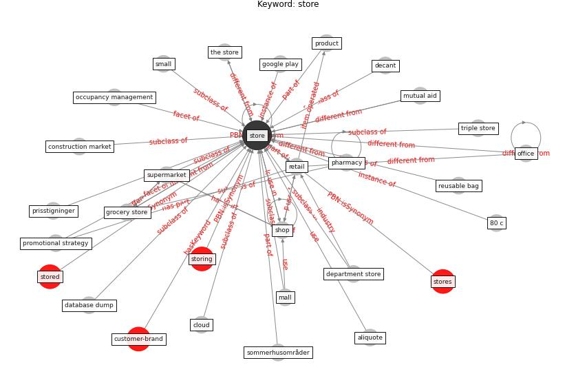

# Keyword: store

* [customer-brand](cluster_Cluster_8)

## Keywords

 * 80 c, Cluster_8, aisle, aliquote, amigo, brick and mortar, [business](keyword_business), bygne, chick fil a, cloud, construction market, database dump, decant, department store, google play, grocery store, mall, mutual aid, occupancy management, [office](keyword_office), pharmacy, prisstigninger, product, promotional strategy, [retail](keyword_retail), reusable bag, shop, small, sommerhusområder, [store](keyword_store), stored, stores, storing, supermarket, the store, triple store, viklet

## Concepts

 

## Neighbours

### Closest articles

* How COVID-19 Could Accelerate the Adoption of New Retail Technologies and Enhance the (E-)Servicescape - [LINK](article_willems_how_2021)
* Retail Signage During the COVID-19 Pandemic - [LINK](article_mcneish_retail_2020)
* How is COVID-19 Experience Transforming Sustainability Requirements of Residential Buildings? A Review - [LINK](article_tokazhanov_how_2020)
* A Continuously Active Antimicrobial Coating effective against Human Coronavirus 229E - [LINK](article_ikner_continuously_2020)
* Refleksioner fra en pandemi - [LINK](article_realdania_refleksioner_2022)
* Pandemiens arkitektur - [LINK](article_realdania_pandemiens_2022)
* Detection of SARS-CoV-2 in raw and treated wastewater in Germany – Suitability for COVID-19 surveillance and potential transmission risks - [LINK](article_westhaus_detection_2021)
* The effect of occupant distribution on energy consumption and COVID-19 infection in buildings: A case study of university building - [LINK](article_mokhtari_effect_2021)
* An Overview of Biomedical Ontologies for Pandemics and Infectious Diseases Representation - [LINK](article_bayoudhi_overview_2021)

### Closest BPs

