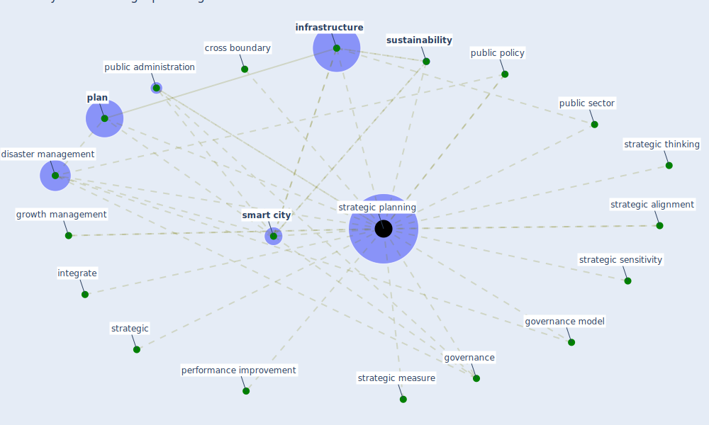

# Keyword: strategic planning

## Keywords

 * cross boundary, disaster management, governance, governance model, growth management, [infrastructure](keyword_infrastructure), integrate, performance improvement, [plan](keyword_plan), [public administration](keyword_public_administration), public policy, public sector, [smart city](keyword_smart_city), strategic, strategic alignment, strategic measure, [strategic planning](keyword_strategic_planning), strategic sensitivity, strategic thinking, [sustainability](keyword_sustainability)

## Mapping

## Neighbours

### Closest articles

* Learning from the COVID-19 pandemic in governing smart cities - [LINK](article_bolivar_learning_2022)
* Urban planning after COVID-19 - [LINK](article_rtpi_urban_2021)
* How COVID-19 Could Accelerate the Adoption of New Retail Technologies and Enhance the (E-)Servicescape - [LINK](article_willems_how_2021)

### Closest BPs

