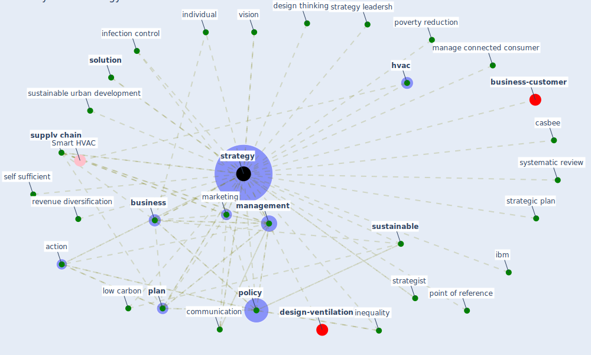

# Keyword: strategy

* [design-ventilation](cluster_11)

* [business-customer](cluster_12)

## Keywords

 * Cluster_11, Cluster_12, action, adaptive, adaptive design, aec, branch, [business](keyword_business), business model, business perspective, can china strategy work, casbee, [case](keyword_case), case 3 5, challenge, china strategy, communication, [consumer](keyword_consumer), cope, covid 19 crisis in jordan, database, datum drive, datum drive method, decision maker, design thinking, disruption, dynamic, empirical, energy energy saving, european policy framework, [facility management](keyword_facility_management), flip classroom, future of construction strategy, guidance, housing market dynamic, [hvac](keyword_hvac), ibm, individual, industry strategy, inequality, [infection control](keyword_infection_control), intervention, leadership, low carbon, manage connect consumer, manage connected consumer, [management](keyword_management), management strategy, [marketing](keyword_marketing), marketing strategy, maslow s framework, [method](keyword_method), pac man, pac man strategy, [plan](keyword_plan), point of reference, [policy](keyword_policy), policy framework, policy motivation, poverty reduction, process, [protocol](keyword_protocol), [public health](keyword_public_health), [research](keyword_research), [resilience](keyword_resilience), resilient, resilient planning, rethink stakeholder helixe, revenue diversification, risk management, safe environment, search strategy, secure business success, self care, self sufficient, self sufficient strategy, service marketing, skill offensive, [solution](keyword_solution), stakeholder helixe, strategic plan, strategies, strategies will not be expected to work the same everywhere, strategist, [strategy](keyword_strategy), strategy leadersh, [supply chain](keyword_supply_chain), [sustainable](keyword_sustainable), sustainable urban development, systematic review, urban healthinitiative, urban resilience, vaccine hesitancy, vision

## Mapping

## Neighbours

### Closest articles

* How COVID-19 Could Accelerate the Adoption of New Retail Technologies and Enhance the (E-)Servicescape - [LINK](article_willems_how_2021)
* COVID-19 and regional solutions for mitigating the risk of SME finance in selected ASEAN member states - [LINK](article_taghizadeh-hesary_covid-19_2022)
* Sustainable work throughout the life course: National policies and strategies, Publications Office of the European Union - [LINK](article_eurofund_sustainable_2016)
* Urban planning after COVID-19 - [LINK](article_rtpi_urban_2021)
* Mechanisms for addressing the impact of COVID-19 on infrastructure projects - [LINK](article_king_mechanisms_2021)
* Health, Economic and Social Development Challenges of the COVID-19 Pandemic: Strategies for Multiple and Interconnected Issues - [LINK](article_panneer_health_2022)
* Health, Wellbeing \& Productivity in Offices - [LINK](article_world_green_building_council_health_2014)
* Housing Experience in Gated Communities in the Time of Pandemics: Lessons Learned from COVID-19 - [LINK](article_asfour_housing_2022)
* Challenges to Mitigating the Urban Health Burden of Mosquito-Borne Diseases in the Face of Climate Change - [LINK](article_ligsay_challenges_2021)
* World Bank Development Report - [LINK](article_world_bank_world_2022)

### Closest BPs

