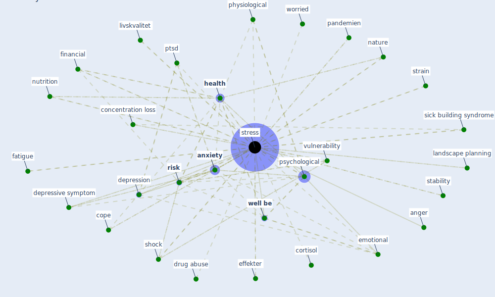

# Keyword: stress

## Keywords

 * 101 stress, anger, [anxiety](keyword_anxiety), anxiety recovery, anxiety relate to the pandemic, anxious, attention fatigue, attentionߖfatigue, autonomic, [child](keyword_child), [chronic disease](keyword_chronic_disease), comprehension, [concentration](keyword_concentration), concentration loss, [constraint](keyword_constraint), cope, cortisol, [covid-19](keyword_covid-19), daily life, decrease productivity, [depression](keyword_depression), [depressive symptom](keyword_depressive_symptom), desensitisation, drug abuse, effekter, emotional, [environment](keyword_environment), [exposure](keyword_exposure), extremely high range, family struggle to cope, fatigue, fatigue anxiety, fear of the future, financial, forebygger, [green space](keyword_green_space), happiness, happy, [health](keyword_health), healthcare system worldwide, [high](keyword_high), high range, human relate issue, ikke et særligt veldefineret ord, [indoor air quality](keyword_indoor_air_quality), inflammatory, kutnar, landscape planning, [livskvalitet](keyword_livskvalitet), livskvalitetssynspunkt, [lockdown](keyword_lockdown), [loneliness](keyword_loneliness), low impact recur shock, [mental](keyword_mental), mood, mood anxiety, natur og grønne områder, [nature](keyword_nature), negative feeling, negative mood, nervous, nutrition, [pandemien](keyword_pandemien), physiological, positive emotion, problemerne, [productivity](keyword_productivity), [psychological](keyword_psychological), psykisk, ptsd, [public health](keyword_public_health), [quality](keyword_quality), [resilience](keyword_resilience), [risk](keyword_risk), [shock](keyword_shock), sick building syndrome, [sleep](keyword_sleep), stability, stigma, strain, [stress](keyword_stress), stress reliever, stressed, stresses, stressful, [symptom](keyword_symptom), [system](keyword_system), så autonomt som muligt, tension, testiness, underlie issue, unemployed, urban nature experience, veldefineret, [vulnerability](keyword_vulnerability), [well be](keyword_well_be), [work](keyword_work), [worker](keyword_worker), worried, young

## Mapping

## Neighbours

### Closest articles

* Psychological Effects of Home Confinement and Social Distancing Derived from COVID-19 in the General Population—A Systematic Review - [LINK](article_rodriguez-fernandez_psychological_2021)
* Occupant health in buildings: Impact of the COVID-19 pandemic on the opinions of building professionals and implications on research - [LINK](article_awada_occupant_2022)
* Refleksioner fra en pandemi - [LINK](article_realdania_refleksioner_2022)
* Impacts of COVID-19 on Health and Safety of Workforce in Construction Industry - [LINK](article_pamidimukkala_impacts_2021)
* Learning from pandemics: Applying resilience thinking to identify priorities for planning urban settlements - [LINK](article_syal_learning_2021)
* Green spaces, especially forest, linked to lower SARS-CoV-2 infection rates: A one-year nationwide study - [LINK](article_jiang_green_2021)
* Dangerous liaisons? Applying the social harm perspective to the social inequality, housing and health trifecta during the Covid-19 pandemic - [LINK](article_gurney_dangerous_2021)
* Guidelines for resilience systems analysis - [LINK](article_oecd_guidelines_2014)
* How is COVID-19 Experience Transforming Sustainability Requirements of Residential Buildings? A Review - [LINK](article_tokazhanov_how_2020)
* The impacts of knowledge, risk perception, emotion and information on citizens’ protective behaviors during the outbreak of COVID-19: a cross-sectional study in China - [LINK](article_ning_impacts_2020)

### Closest BPs

