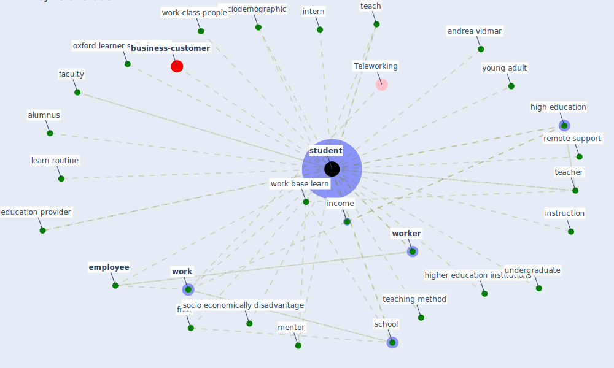

# Keyword: student

* [business-customer](cluster_11)

## Keywords

 * Cluster_11, alumnus, andrea vidmar, education provider, [employee](keyword_employee), faculty, free, high education, higher education institutions, income, instruction, intern, learn routine, mentor, oxford learner s dictionary, remote support, [school](keyword_school), socio economically disadvantage, sociodemographic, [student](keyword_student), students, teach, teacher, teaching method, undergraduate, [work](keyword_work), [work base learn](keyword_work_base_learn), work class people, [worker](keyword_worker), young adult

## Mapping

## Neighbours

### Closest articles

* Case Study on Finnish TVETA Resilient Model of Training During COVID-19 - [LINK](article_unesco_case_2021)
* Reframe how to serve your community in the midst of a pandemic - [LINK](article_sutton_reframe_2020)
* COVID19-Routes: A Safe Pedestrian Navigation Service - [LINK](article_cantarero_covid19-routes_2021)
* Design COVID-19 Ontology: A Healthcare and Safety Perspective - [LINK](article_aloulou_design_2022)
* How is COVID-19 Experience Transforming Sustainability Requirements of Residential Buildings? A Review - [LINK](article_tokazhanov_how_2020)
* COVID-19 risks and systemic gaps in Nigeria: resilience building lessons for pandemic and climate change management - [LINK](article_lawal_covid-19_2022)
* How the 5G Enabled the COVID-19 Pandemic Prevention and Control: Materiality, Affordance, and (De-)Spatialization - [LINK](article_li_how_2022)
* Rotating groups at work, school best against COVID-19 spread: Study - [LINK](article_afp_rotating_2021)
* How can airborne transmission of COVID-19 indoors be minimised? - [LINK](article_morawska_how_2020)
* Green in times of COVID-19: urban green space relevance during the COVID-19 pandemic in Buenos Aires City - [LINK](article_marconi_green_2022)

### Closest BPs

