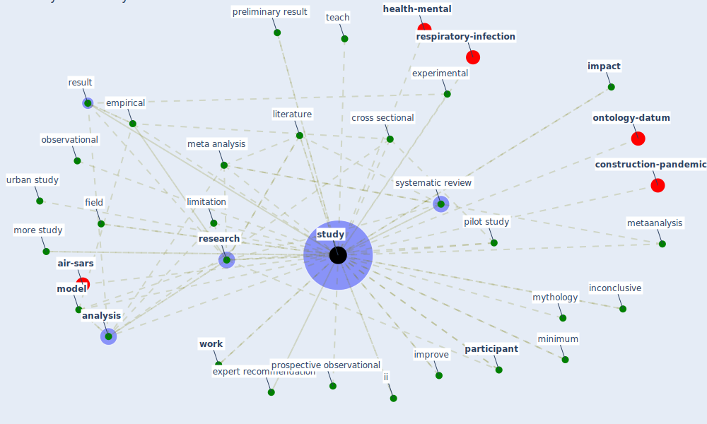

# Keyword: study

* [health-city](cluster_0)

* [space-housing](cluster_1)

* [wastewater-water](cluster_2)

* [building-design](cluster_3)

* [design-ventilation](cluster_4)

* [construction-project](cluster_5)

* [air-uv](cluster_8)

* [business-customer](cluster_9)

* [space-cid](cluster_10)

* [obesity-county](cluster_11)

* [iaq-system](cluster_12)

## Keywords

 * Cluster_1, Cluster_10, Cluster_8, Cluster_9, [analysis](keyword_analysis), andalusian study, [bank](keyword_bank), bias, case control, case study, challenge study, [clinical](keyword_clinical), conceptual, control setting, cross sectional, crosssectional, ecological, empirical, experimental, expert recommendation, exploratory, exploratory approach, full paper, full paper screening, further study, furtheranalyzed, gao, ii, [impact](keyword_impact), improve, inconclusive, laboratory, limitation, limitation of this study, literature, literature review, longitudinal, manage, maritime study, [meta analysis](keyword_meta_analysis), metaanalysis, [method](keyword_method), methodology, minimum, [model](keyword_model), more study, mortality rate, multicentre, multidisciplinary, mythology, nardell, neuroscientist, observational, occupant preference, [office](keyword_office), online form, overview, [participant](keyword_participant), [patient](keyword_patient), pilot experiment, pilot study, polynomial, preliminary result, prospective observational, [qualitative](keyword_qualitative), qualitative research, quantitative study, questionnaire, random sampling, relative humidity, [remote work](keyword_remote_work), [research](keyword_research), research interest, research study, [result](keyword_result), retrospective observational, risk of bias, robust, scientist, screen, [study](keyword_study), studying, sufficient area for online education, [survey](keyword_survey), systematic review, systematically assess what factor shape such compliance, teach, [technology](keyword_technology), [theme](keyword_theme), theory, travel restriction, urban study, user study, virology, w1 w51, w25, why be this study do, [work](keyword_work), work in progress, field

## Mapping

## Neighbours

### Closest articles

* COVID-19 Prevention and Control Measures in Workplace Settings: A Rapid Review and Meta-Analysis - [LINK](article_ingram_covid-19_2021)
* An Overview of Ontologies and Tool Support for COVID-19 Analytics - [LINK](article_ahmad_overview_2021)
* Physical interventions to interrupt or reduce the spread of respiratory viruses: systematic review - [LINK](article_jefferson_physical_2008)
* Occupant health in buildings: Impact of the COVID-19 pandemic on the opinions of building professionals and implications on research - [LINK](article_awada_occupant_2022)
* Psychological Effects of Home Confinement and Social Distancing Derived from COVID-19 in the General Population—A Systematic Review - [LINK](article_rodriguez-fernandez_psychological_2021)
* Methods for air cleaning and protection of building occupants from airborne pathogens - [LINK](article_bolashikov_methods_2009)
* Health, Wellbeing \& Productivity in Offices - [LINK](article_world_green_building_council_health_2014)
* Treating two pandemics for the price of one: Chronic and infectious disease impacts of the built and natural environment - [LINK](article_frank_treating_2021)
* COVID-19 and regional solutions for mitigating the risk of SME finance in selected ASEAN member states - [LINK](article_taghizadeh-hesary_covid-19_2022)

### Closest BPs

