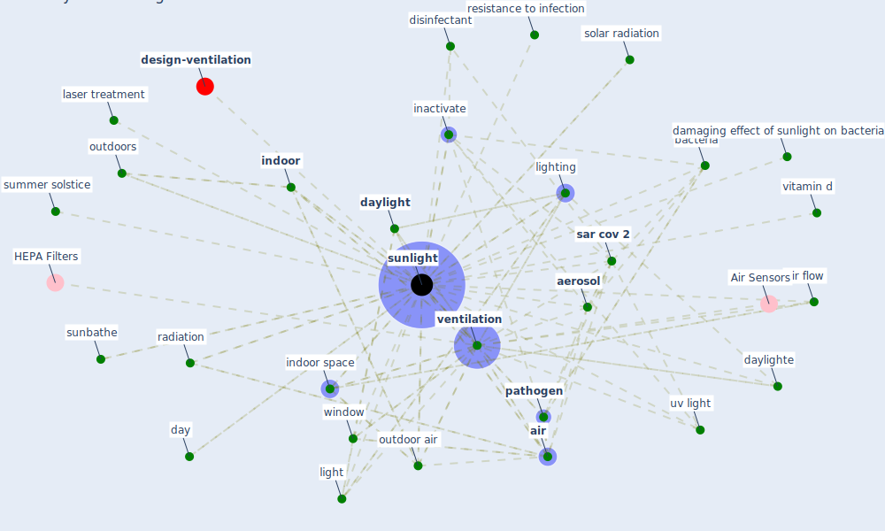

# Keyword: sunlight

* [design-ventilation](cluster_12)

## Keywords

 * 45th parallel north, Cluster_12, [aerosol](keyword_aerosol), [air](keyword_air), air flow, [bacteria](keyword_bacteria), bacteria layer thickness exposure, damaging effect of sunlight on bacteria, day, [daylight](keyword_daylight), daylighte, [disinfectant](keyword_disinfectant), [exposure](keyword_exposure), fresh air, [germicidal](keyword_germicidal), glass, heat, inactivate, [indoor](keyword_indoor), indoor space, laser treatment, light, lighting, [natural](keyword_natural), outdoor, outdoor air, outdoors, [pathogen](keyword_pathogen), radiation, resistance to infection, [sar cov 2](keyword_sar_cov_2), set sun, solar radiation, summer solstice, sunbathe, [sunlight](keyword_sunlight), [uv](keyword_uv), [uv light](keyword_uv_light), [ventilation](keyword_ventilation), vitamin d, [window](keyword_window)

## Mapping

## Neighbours

### Closest articles

* Architectural design strategies for infection prevention and control (IPC) in health-care facilities: towards curbing the spread of Covid-19 \textbar SpringerLink - [LINK](article_udomiaye_architectural_2020)
* A Review on Building Design as a Biomedical System for Preventing COVID-19 Pandemic - [LINK](article_amran_review_2022)
* Adaptive Design of the Built Environment to Mitigate the Transmission Risk of COVID-19 - [LINK](article_ara_dilshad_shangi_adaptive_2020)
* Houses amid COVID-19: Environmental challenges and design adaptation - [LINK](article_hizra_houses_2021)
* COVID-19 Could Leverage a Sustainable Built Environment - [LINK](article_pinheiro_covid-19_2020)
* Environmental factors involved in SARS-CoV-2 transmission: effect and role of indoor environmental quality in the strategy for COVID-19 infection control - [LINK](article_azuma_environmental_2020)
*  - [LINK](article_yakubu_aminu_dodo_green_2020)
* Prophylactic Architecture: Formulating the Concept of Pandemic-Resilient Homes - [LINK](article_elrayies_prophylactic_2022)
* The Role of Architecture and Urbanism in Preventing Pandemics - [LINK](article_kumar_role_2021)
* Assessment method for new sustainability indicators providing pandemic resilience for residential buildings - [LINK](article_tokazhanov_assessment_2021)

### Closest BPs

