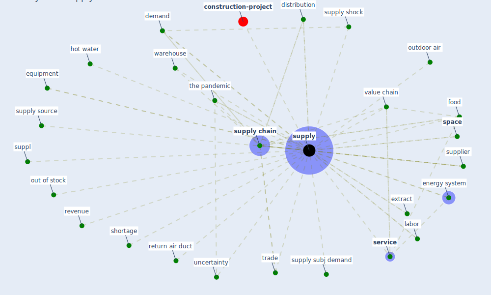

# Keyword: supply

* [construction-project](cluster_8)

## Keywords

 * Cluster_8, availability, backup energy, clean air supply, controlmeasure, credit, demand, disruption in the supply chain, distribution, [energy consumption](keyword_energy_consumption), energy system, equipment, extract, fan coil, food, food truck, hoard, hot water, labor, [marketing](keyword_marketing), out of stock, outdoor air, pandemic influenza vaccine, [personal protective equipment](keyword_personal_protective_equipment), ppe covid 19, production, production chain, reliable energy supply, return air duct, revenue, [service](keyword_service), shortage, [space](keyword_space), suppl, supplied, supplier, supplies, [supply](keyword_supply), [supply chain](keyword_supply_chain), supply shock, supply source, supply subj demand, the pandemic, trade, uncertainty, value chain, warehouse

## Mapping

## Neighbours

### Closest articles

* Global value chains: Efficiency and risks in the context of COVID-19 - [LINK](article_oecd_global_2021)
* How COVID-19 Could Accelerate the Adoption of New Retail Technologies and Enhance the (E-)Servicescape - [LINK](article_willems_how_2021)
* A critical analysis of the impacts of COVID-19 on the global economy and ecosystems and opportunities for circular economy strategies - [LINK](article_ibn-mohammed_critical_2021)
* World Bank Development Report - [LINK](article_world_bank_world_2022)
* Mapping research in logistics and supply chain management during COVID-19 pandemic - [LINK](article_montoya-torres_mapping_2021)
* COVID-19 and Green Housing: A Review of Relevant Literature - [LINK](article_kaklauskas_covid-19_2021)
* The Smart City and Covid‐19 - [LINK](article_webb_smart_2020)
* A Mixed Approach on Resilience of Spanish Dwellings and Households during COVID-19 Lockdown - [LINK](article_cuerdo-vilches_mixed_2020)
* The impact of COVID-19 and strategies for mitigation and suppression in low- and middle-income countries - [LINK](article_walker_impact_2020)
* Contextualizing the Covid-19 pandemic for a carbon-constrained world: Insights for sustainability transitions, energy justice, and research methodology - [LINK](article_sovacool_contextualizing_2020)

### Closest BPs

