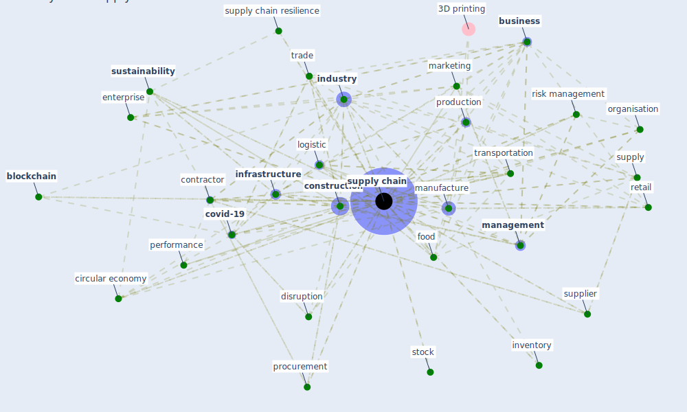

# Keyword: supply chain

## Keywords

 * actor, [blockchain](keyword_blockchain), [business](keyword_business), buyer, [circular economy](keyword_circular_economy), [construction](keyword_construction), [construction industry](keyword_construction_industry), consumer good, [contractor](keyword_contractor), covid 19 outbreak, [covid-19](keyword_covid-19), [customer](keyword_customer), datum management, demand, disruption, disruption management, distribution, distribution channel, distribution system, dyadic, [ecosystem](keyword_ecosystem), [efficiency](keyword_efficiency), end point, enterprise, [factory](keyword_factory), food, food service industry, global, good, [industry](keyword_industry), [infrastructure](keyword_infrastructure), intertwine, inventory, life cycle, [logistic](keyword_logistic), logistic management, [management](keyword_management), [manufacture](keyword_manufacture), manufacturer, [marketing](keyword_marketing), material, meat production, methodology, movement, nearshore, [network](keyword_network), network configuration, network design, network design problem, [ontology](keyword_ontology), operation, optimize, [organisation](keyword_organisation), panic buying, performance, procurement, production, production ecosystem, production line, [project](keyword_project), purchase, [resilience](keyword_resilience), retail, retail industry, retail operation, risk management, secondary source of supply, [sector](keyword_sector), self isolation policy, serial, [shock](keyword_shock), source strategy, [stakeholder](keyword_stakeholder), stock, strategy, supplier, [supply](keyword_supply), [supply chain](keyword_supply_chain), supply chain disruption, supply chain insurance, [supply chain management](keyword_supply_chain_management), supply chain resilience, supply chain strategy, supply chain system, supply chain visibility, supply management, supply path, supply risk, supply system, [sustainability](keyword_sustainability), synchronisation, [system](keyword_system), third party logistic, trade, transformation, transportation, triple a, up, value generation, [vulnerability](keyword_vulnerability)

## Mapping

## Neighbours

### Closest articles

* Mapping research in logistics and supply chain management during COVID-19 pandemic - [LINK](article_montoya-torres_mapping_2021)
* How COVID-19 Could Accelerate the Adoption of New Retail Technologies and Enhance the (E-)Servicescape - [LINK](article_willems_how_2021)
* A critical analysis of the impacts of COVID-19 on the global economy and ecosystems and opportunities for circular economy strategies - [LINK](article_ibn-mohammed_critical_2021)
* Impact of COVID-19 on IoT Adoption in Healthcare, Smart Homes, Smart Buildings, Smart Cities, Transportation and Industrial IoT - [LINK](article_umair_impact_2021)
* Global value chains: Efficiency and risks in the context of COVID-19 - [LINK](article_oecd_global_2021)
* Guidelines for Responding to COVID-19 Pandemic: Best Practices, Impacts, and Future Research Directions - [LINK](article_assaad_guidelines_2021)
* The COVID-19 pandemic: Lessons on building more equal and sustainable societies - [LINK](article_van_barneveld_covid-19_2020)
* Mechanisms for addressing the impact of COVID-19 on infrastructure projects - [LINK](article_king_mechanisms_2021)
* World Bank Development Report - [LINK](article_world_bank_world_2022)
* Perception of COVID-19 impacts on the construction industry over time - [LINK](article_rokooei_perception_2022)

### Closest BPs

