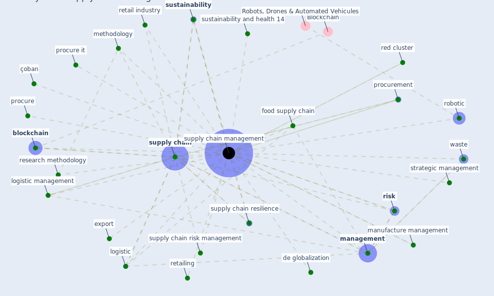

# Keyword: supply chain management

## Keywords

 * [blockchain](keyword_blockchain), de globalization, export, food supply chain, [logistic](keyword_logistic), logistic management, [management](keyword_management), manufacture management, methodology, procure, procure it, procurement, red cluster, research methodology, retail industry, retailing, [risk](keyword_risk), [robotic](keyword_robotic), strategic management, [supply chain](keyword_supply_chain), [supply chain management](keyword_supply_chain_management), supply chain resilience, supply chain risk management, [sustainability](keyword_sustainability), sustainability and health 14, waste, çoban

## Mapping

## Neighbours

### Closest articles

* Mapping research in logistics and supply chain management during COVID-19 pandemic - [LINK](article_montoya-torres_mapping_2021)
* Overcoming the Impact of COVID-19 Using Integrated Project Delivery Model - [LINK](article_g_overcoming_2020)
* How COVID-19 Could Accelerate the Adoption of New Retail Technologies and Enhance the (E-)Servicescape - [LINK](article_willems_how_2021)
* Borders and Catastrophe: lessons from COVID-19 for the European Green Deal - [LINK](article_klein_borders_2021)
* Leveraging Digital Transformation Technologies to Tackle COVID-19: Proposing a Privacy-First Holistic Framework - [LINK](article_arpaci_leveraging_2021)
* Global value chains: Efficiency and risks in the context of COVID-19 - [LINK](article_oecd_global_2021)
* Blockchain technology and its applications to combat COVID-19 pandemic - [LINK](article_sharma_blockchain_2022)
* Digital Twin of COVID-19 Mass Vaccination Centers - [LINK](article_pilati_digital_2021)
* The role of 5G for digital healthcare against COVID-19 pandemic: Opportunities and challenges - [LINK](article_siriwardhana_role_2021)

### Closest BPs

