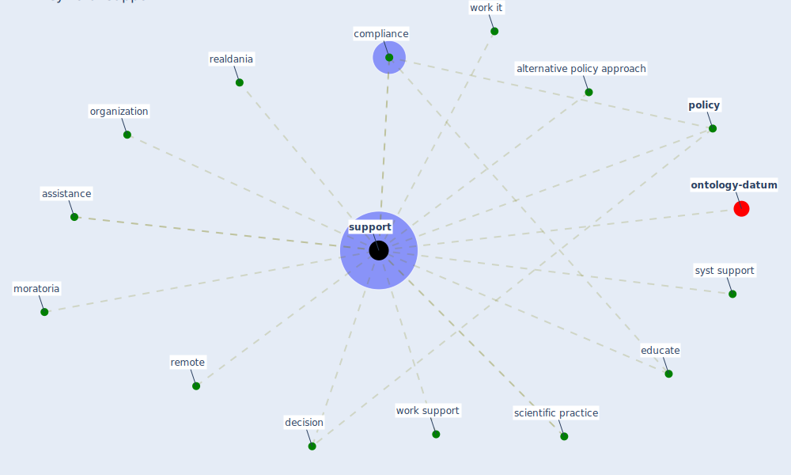

# Keyword: support

* [ontology-datum](cluster_12)

## Keywords

 * Cluster_12, alternative policy approach, assistance, [compliance](keyword_compliance), decision, educate, moratoria, organization, [policy](keyword_policy), realdania, remote, scientific practice, [support](keyword_support), supporting, supports, syst support, work it, work support

## Mapping

## Neighbours

### Closest articles

* Management of the COVID-19 pandemic: challenges, practices, and organizational support - [LINK](article_hossny_management_2022)
* World Bank Development Report - [LINK](article_world_bank_world_2022)
* The Intelligent Lockdown: Compliance with COVID-19 Mitigation Measures in the Netherlands - [LINK](article_kuiper_intelligent_2020)
* Sustainable work throughout the life course: National policies and strategies, Publications Office of the European Union - [LINK](article_eurofund_sustainable_2016)
* Assessment of COVID-19 precautionary measures in sports facilities: A case study on a health club in Saudi Arabia - [LINK](article_ibrahim_assessment_2022)
* Impact of Covid-19 on the built environment - [LINK](article_mahima_impact_2022)
* COVID-19 pandemic: the effects and prospects in the construction industry. - [LINK](article_ogunnusi_covid-19_2020)
* Refleksioner fra en pandemi - [LINK](article_realdania_refleksioner_2022)
* COVID-19 and regional solutions for mitigating the risk of SME finance in selected ASEAN member states - [LINK](article_taghizadeh-hesary_covid-19_2022)

### Closest BPs

