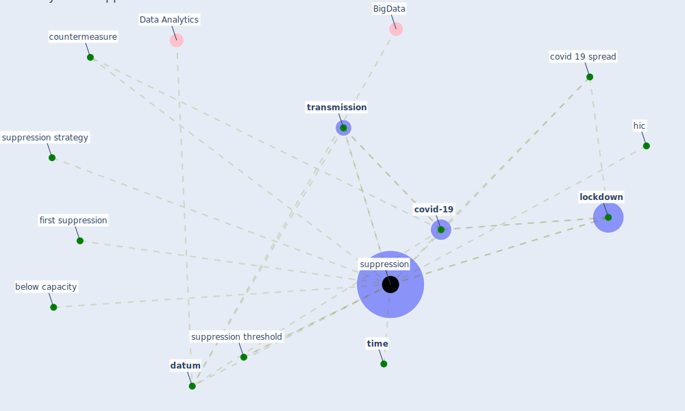

# Keyword: suppression

## Keywords

 * below capacity, countermeasure, covid 19 spread, [covid-19](keyword_covid-19), [datum](keyword_datum), first suppression, [hic](keyword_hic), [lockdown](keyword_lockdown), [suppression](keyword_suppression), suppression strategy, suppression threshold, [time](keyword_time), [transmission](keyword_transmission)

## Mapping

## Neighbours

### Closest articles

* The impact of COVID-19 and strategies for mitigation and suppression in low- and middle-income countries - [LINK](article_walker_impact_2020)
* Wastewater surveillance for population-wide Covid-19: The present and future - [LINK](article_daughton_wastewater_2020)
* The Intelligent Lockdown: Compliance with COVID-19 Mitigation Measures in the Netherlands - [LINK](article_kuiper_intelligent_2020)
* World Bank Development Report - [LINK](article_world_bank_world_2022)
* Supporting Technologies for COVID-19 Prevention: Systemized Review - [LINK](article_zhao_supporting_2022)

### Closest BPs

