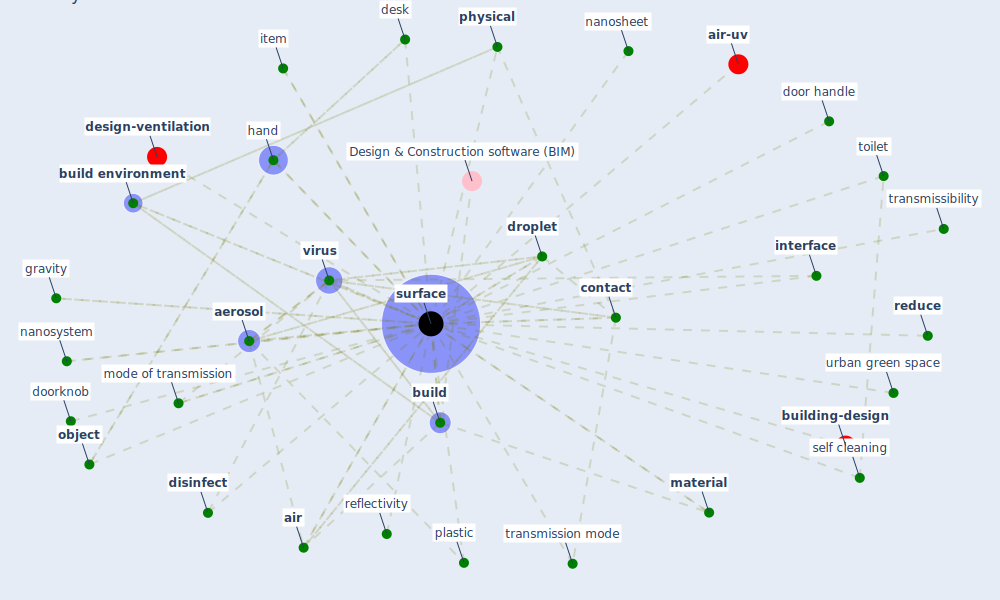

# Keyword: surface

* [building-design](cluster_5)

* [design-ventilation](cluster_10)

* [air-uv](cluster_12)

## Keywords

 * Cluster_10, Cluster_12, Cluster_5, [aerosol](keyword_aerosol), [air](keyword_air), [antimicrobial](keyword_antimicrobial), [architect](keyword_architect), atmospheric climate change, [build](keyword_build), [build environment](keyword_build_environment), cardboard, [contact](keyword_contact), [contamination](keyword_contamination), counter top, [desk](keyword_desk), [disinfect](keyword_disinfect), [disinfection](keyword_disinfection), door handle, doorknob, [droplet](keyword_droplet), elevator, facade, faecal, frequency of touch, gravity, hand, heat island, human excreta, [infrastructure](keyword_infrastructure), [interface](keyword_interface), item, keyboard, [material](keyword_material), medium, [microorganism](keyword_microorganism), mode of transmission, moiety, nanosheet, nanosystem, non porous surface, nuclei, [object](keyword_object), office desk, paint, [personal protective equipment](keyword_personal_protective_equipment), [physical](keyword_physical), plastic, polymeric, public restroom, [reduce](keyword_reduce), reduce reduce surface, reflectivity, self clean space, self cleaning, spherical, [surface](keyword_surface), surface material, surface subj earth, surfaces, tip, [toilet](keyword_toilet), transmissibility, transmission mode, [type](keyword_type), type of surface, [urban green space](keyword_urban_green_space), [uvgi](keyword_uvgi), [virus](keyword_virus), washbasin, washbasin surface

## Mapping

## Neighbours

### Closest articles

* Graphene-based nanomaterials as antimicrobial surface coatings: A parallel approach to restrain the expansion of COVID-19 - [LINK](article_ayub_graphene-based_2021)
* Toilets dominate environmental detection of SARS-CoV-2 virus in a hospital - [LINK](article_ding_toilets_2020)
* COVID-19 Could Leverage a Sustainable Built Environment - [LINK](article_pinheiro_covid-19_2020)
* A Global Survey of Infection Control and Mitigation Measures for Combating the Transmission of COVID-19 Pandemic in Buildings Under Facilities Management Services - [LINK](article_sarvari_global_2022)
* Assessment method for new sustainability indicators providing pandemic resilience for residential buildings - [LINK](article_tokazhanov_assessment_2021)
* Designing a Multi-Agent Occupant Simulation System to Support Facility Planning and Analysis for COVID-19 - [LINK](article_lee_designing_2021)
* COVID-19 Experience Transforming the Protective Environment of Office Buildings and Spaces - [LINK](article_phapant_covid-19_2021)
* A Review on Building Design as a Biomedical System for Preventing COVID-19 Pandemic - [LINK](article_amran_review_2022)
* Readiness Assessment of Green Building Certification Systems for Residential Buildings during Pandemics - [LINK](article_tleuken_readiness_2021)
* Architectural design strategies for infection prevention and control (IPC) in health-care facilities: towards curbing the spread of Covid-19 \textbar SpringerLink - [LINK](article_udomiaye_architectural_2020)

### Closest BPs

