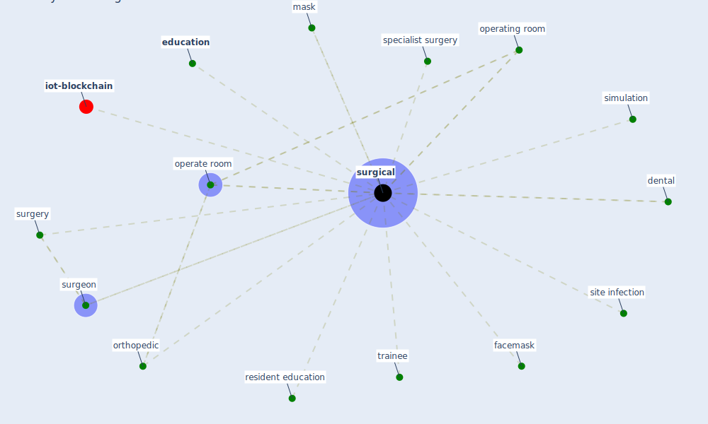

# Keyword: surgical

* [iot-blockchain](cluster_7)

## Keywords

 * Cluster_7, dental, [education](keyword_education), facemask, [mask](keyword_mask), operate room, operating room, orthopedic, resident education, [simulation](keyword_simulation), site infection, specialist surgery, surgeon, [surgery](keyword_surgery), [surgical](keyword_surgical), trainee

## Mapping

## Neighbours

### Closest articles

* Using Technology to Maintain the Education of Residents During the COVID-19 Pandemic - [LINK](article_chick_using_2020)
* A critical review of heating, ventilation, and air conditioning (HVAC) systems within the context of a global SARS-CoV-2 epidemic - [LINK](article_elsaid_critical_2021)
* COVID-19 Pandemic: Prevention and Protection Measures to Be Adopted at the Workplace - [LINK](article_cirrincione_covid-19_2020)
* Multilevel Analysis of Personal, Non-Medical COVID-19-Related Impact Worldwide - [LINK](article_dye_multilevel_2020)
* COVID-19 and its Modes of Transmission - [LINK](article_karia_covid-19_2020)
* The role of 5G for digital healthcare against COVID-19 pandemic: Opportunities and challenges - [LINK](article_siriwardhana_role_2021)
* Environmental factors involved in SARS-CoV-2 transmission: effect and role of indoor environmental quality in the strategy for COVID-19 infection control - [LINK](article_azuma_environmental_2020)
* Far-UVC light (222 nm) efficiently and safely inactivates airborne human coronaviruses - [LINK](article_buonanno_far-uvc_2020)
* The ventilation of buildings and other mitigating measures for COVID-19: a focus on wintertime - [LINK](article_burridge_ventilation_2021)

### Closest BPs

