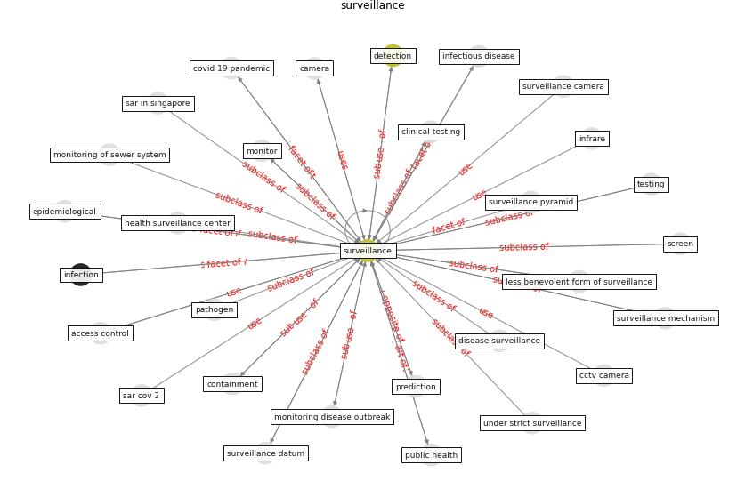

# Keyword: surveillance

* [wastewater-sars](cluster_Cluster_2)

## Keywords

 * access control, armed force health surveillance center, auto regulation, awareness, breach of privacy, [camera](keyword_camera), case based risk mapping, case based risk maps, case isolation, categorize surveillance, cctv, cctv camera, civil liberty issue, cloud, cloud base, communication, community protection, contact trace, containment, [control](keyword_control), covid 19 in singapore, [covid 19 pandemic](keyword_covid_19_pandemic), covid 19 surveillance, [covid-19](keyword_covid-19), cyber security, cyberient, [datum](keyword_datum), datum security, [detection](keyword_detection), disease hotspot, disease surveillance, [drone](keyword_drone), early warning system, [environmental](keyword_environmental), [epidemiological](keyword_epidemiological), [epidemiology](keyword_epidemiology), eurosurveillance, [government](keyword_government), [healthcare](keyword_healthcare), illness monitoring, [infection](keyword_infection), [infectious disease](keyword_infectious_disease), infectious disease surveillance, intervention, intrusive alert, investigation, jmir public health surveill, less benevolent form of surveillance, measurement, [monitor](keyword_monitor), monitoring disease outbreak, monitoring of sewer system, mosquito control, outbreak investigation, outbreak investigation and response, prediction, prevention, [privacy](keyword_privacy), privacy advocate, [public health](keyword_public_health), public health and surveillance, quarantine, risk prediction, rt pcr testing, rt qpcr, [safety](keyword_safety), [sar cov 2](keyword_sar_cov_2), sar in singapore, screen, scrutiny, [security](keyword_security), [smart city](keyword_smart_city), smart technology, smartphone, [society](keyword_society), spatialprogressive elimination, standard operating procedure, [surveillance](keyword_surveillance), surveillance camera, surveillance datum, surveillance mechanism, surveillance pyramid, surveillance system, surveillance video footage, [technology](keyword_technology), temperature effect, testing, trace, trace and track, under strict surveillance, [vector](keyword_vector), vector control, video, video recording, video streaming, video surveillance, [wastewater](keyword_wastewater), wastewater base surveillance, water fingerprinting, wearable technology

## Concepts

 

## Neighbours

### Closest articles

* Integrating rapid risk mapping and mobile phone call record data for strategic malaria elimination planning - [LINK](article_tatem_integrating_2014)
* COVID-19 Prevention and Control Measures in Workplace Settings: A Rapid Review and Meta-Analysis - [LINK](article_ingram_covid-19_2021)
* Future perspectives of wastewater-based epidemiology: Monitoring infectious disease spread and resistance to the community level - [LINK](article_sims_future_2020)
* Impact of COVID-19 on IoT Adoption in Healthcare, Smart Homes, Smart Buildings, Smart Cities, Transportation and Industrial IoT - [LINK](article_umair_impact_2021)
* Prototype Early Warning Systems for Vector-Borne Diseases in Europe - [LINK](article_semenza_prototype_2015)
* Towards the sustainable development of smart cities through mass video surveillance: A response to the COVID-19 pandemic - [LINK](article_shorfuzzaman_towards_2021)
* Dangerous liaisons? Applying the social harm perspective to the social inequality, housing and health trifecta during the Covid-19 pandemic - [LINK](article_gurney_dangerous_2021)
* First detection of SARS-CoV-2 in untreated wastewaters in Italy - [LINK](article_la_rosa_first_2020)
* COVID-19 Pandemic: Rethinking Strategies for Resilient Urban Design, Perceptions, and Planning - [LINK](article_afrin_covid-19_2021)
* Addressing vulnerability, building resilience: community-based adaptation to vector-borne diseases in the context of global change - [LINK](article_bardosh_addressing_2017)

### Closest BPs

