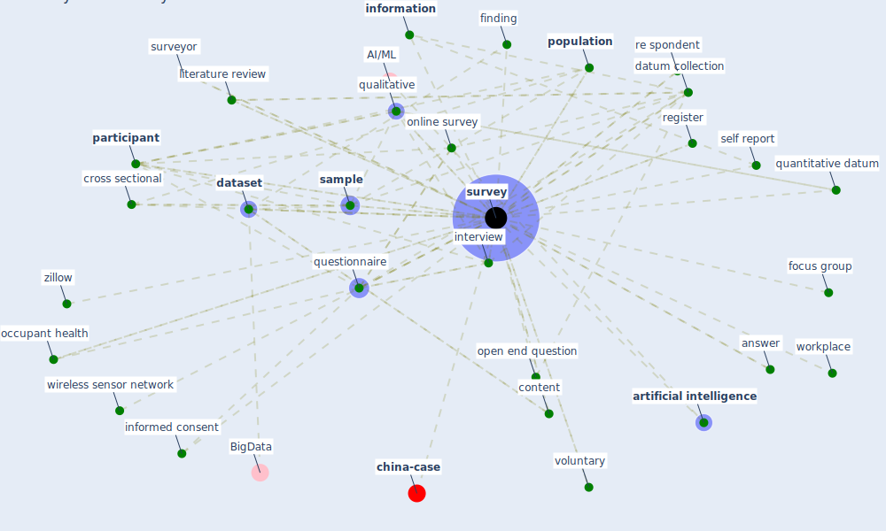

# Keyword: survey

* [china-case](cluster_5)

## Keywords

 * [analysis](keyword_analysis), anonymous, anonymous survey, answer, anthropometric modeling, anthropometric modeling program, [artificial intelligence](keyword_artificial_intelligence), [big datum](keyword_big_datum), compilation, content, core survey, [covid-19](keyword_covid-19), [critical](keyword_critical), cross cultural, cross sectional, customer experience, data collection process, [dataset](keyword_dataset), [datum](keyword_datum), datum collection, datum harmonization, demographic, demographic information, employee survey, ethnographic research, [eurofound](keyword_eurofound), exit interview, finding, focus group, health assessment, health of wisconson, high frequency, [household](keyword_household), housewife relative weight, in situ, [information](keyword_information), informed consent, interview, [knowledge](keyword_knowledge), literature review, live alone, mail survey, marketer, [monitor](keyword_monitor), [object detection](keyword_object_detection), objective measurement, occupant feedback, [occupant health](keyword_occupant_health), online survey, open, open end question, [organisation](keyword_organisation), [participant](keyword_participant), passively, perception, pilot study, [population](keyword_population), [qualitative](keyword_qualitative), qualtric panel, quantitative datum, questionnaire, questionnaire survey, re mitter, re spondent, register, research question, response to survey, result, result discussion section, [sample](keyword_sample), sample size, satisfaction, satisfaction survey, scale, self perception, self report, self selected group, semi structured survey, [sensor](keyword_sensor), smartsurvey, structured questionnaire, [study](keyword_study), subcontractor, [survey](keyword_survey), survey instrument, survey questionnaire, surveyor, validate, validation process, voluntary, web interface, web interface10, well be problem, [wellbee](keyword_wellbee), wenjuanxe, widely use and tamadravalidate scale, wireless sensor network, [workplace](keyword_workplace), workplace survey, zillow

## Mapping

## Neighbours

### Closest articles

* Health, Wellbeing \& Productivity in Offices - [LINK](article_world_green_building_council_health_2014)
* Occupant health in buildings: Impact of the COVID-19 pandemic on the opinions of building professionals and implications on research - [LINK](article_awada_occupant_2022)
* Ten questions concerning occupant health in buildings during normal operations and extreme events including the COVID-19 pandemic - [LINK](article_awada_ten_2021)
* World Bank Development Report - [LINK](article_world_bank_world_2022)
* Attitudes towards outdoor and neighbour noise during the COVID-19 lockdown: A case study in London - [LINK](article_lee_attitudes_2021)
* The impact of the COVID-19 pandemic on the importance of urban green spaces to the public - [LINK](article_noszczyk_impact_2022)
* COVID19-Routes: A Safe Pedestrian Navigation Service - [LINK](article_cantarero_covid19-routes_2021)
* Urban Community Sustainable Development Patterns under the Influence of COVID-19: A Case Study Based on the Non-Contact Interaction Perspective of Hangzhou City - [LINK](article_wang_urban_2021)
* Green in times of COVID-19: urban green space relevance during the COVID-19 pandemic in Buenos Aires City - [LINK](article_marconi_green_2022)
* The Impact of Pandemic Crisis on the Survival of Construction Industry: A Case of COVID-19 - [LINK](article_gamil_impact_2020)

### Closest BPs

