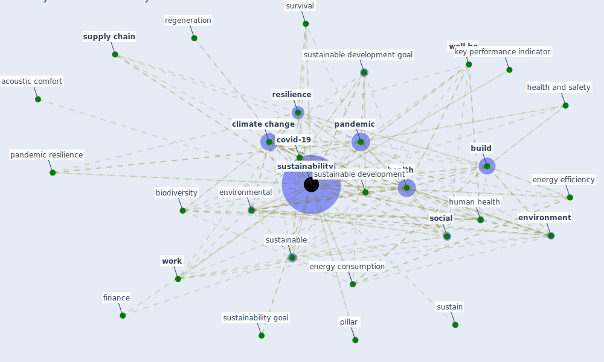

# Keyword: sustainability

* [space-housing](cluster_4)

## Keywords

 * [6 g](keyword_6_g), acoustic, acoustic comfort, action, adaptation to climate change, [architecture](keyword_architecture), automatic door, barrier, benefit, [big datum](keyword_big_datum), [biodiversity](keyword_biodiversity), [biophilic design](keyword_biophilic_design), [build](keyword_build), [build environment](keyword_build_environment), build industry, building direction, [circular economy](keyword_circular_economy), climate action, [climate change](keyword_climate_change), community resilience, concept, construct, [construction](keyword_construction), [construction industry](keyword_construction_industry), [coronavirus](keyword_coronavirus), corporate citizenship, [covid 19 pandemic](keyword_covid_19_pandemic), [covid-19](keyword_covid-19), current pandemic, debt sustainability, [design](keyword_design), development, [economic](keyword_economic), [energy consumption](keyword_energy_consumption), [energy efficiency](keyword_energy_efficiency), [environment](keyword_environment), [environmental](keyword_environmental), executive, finance, food production, foreign aid, green bond, green building certification, green cluster, [green roof](keyword_green_roof), [green space](keyword_green_space), green sustain, [health](keyword_health), [health and safety](keyword_health_and_safety), health safety, [human health](keyword_human_health), hygiene issue, impact assessment, [infrastructure](keyword_infrastructure), intervention, job quality, john habraken, key performance indicator, maintenance, [pandemic](keyword_pandemic), pandemic resilience, pathway to sustainability, performance evaluation, pillar, pre pandemic driver for sustainability, [recovery](keyword_recovery), regeneration, renewable energy, [resilience](keyword_resilience), resource, restoration, scenario, [smart city](keyword_smart_city), smart solution, [social](keyword_social), [supply chain](keyword_supply_chain), [supply chain management](keyword_supply_chain_management), survival, sustain, [sustainability](keyword_sustainability), sustainability 12 13 5343, sustainability 12 14 5863, sustainability basel, sustainability goal, sustainability proof, [sustainable](keyword_sustainable), [sustainable development](keyword_sustainable_development), [sustainable development goal](keyword_sustainable_development_goal), sustainable urbanisation, system think, three pillar, tourism as a conservation tool, un sustainable development goal, waste of energy, wastewater management, [well be](keyword_well_be), [wellbee](keyword_wellbee), win lose, win win, [work](keyword_work)

## Mapping

## Neighbours

### Closest articles

* COVID-19 Could Leverage a Sustainable Built Environment - [LINK](article_pinheiro_covid-19_2020)
* Readiness Assessment of Green Building Certification Systems for Residential Buildings during Pandemics - [LINK](article_tleuken_readiness_2021)
* Mapping research in logistics and supply chain management during COVID-19 pandemic - [LINK](article_montoya-torres_mapping_2021)
* Urban planning after COVID-19 - [LINK](article_rtpi_urban_2021)
* Biophilic design in architecture and its contributions to health, well-being, and sustainability: A critical review - [LINK](article_zhong_biophilic_2022)
* How COVID-19 Redefines the Concept of Sustainability - [LINK](article_hakovirta_how_2020)
* Sustainable work throughout the life course: National policies and strategies, Publications Office of the European Union - [LINK](article_eurofund_sustainable_2016)
* Health, Wellbeing \& Productivity in Offices - [LINK](article_world_green_building_council_health_2014)
* How is COVID-19 Experience Transforming Sustainability Requirements of Residential Buildings? A Review - [LINK](article_tokazhanov_how_2020)
* Assessment method for new sustainability indicators providing pandemic resilience for residential buildings - [LINK](article_tokazhanov_assessment_2021)

### Closest BPs

