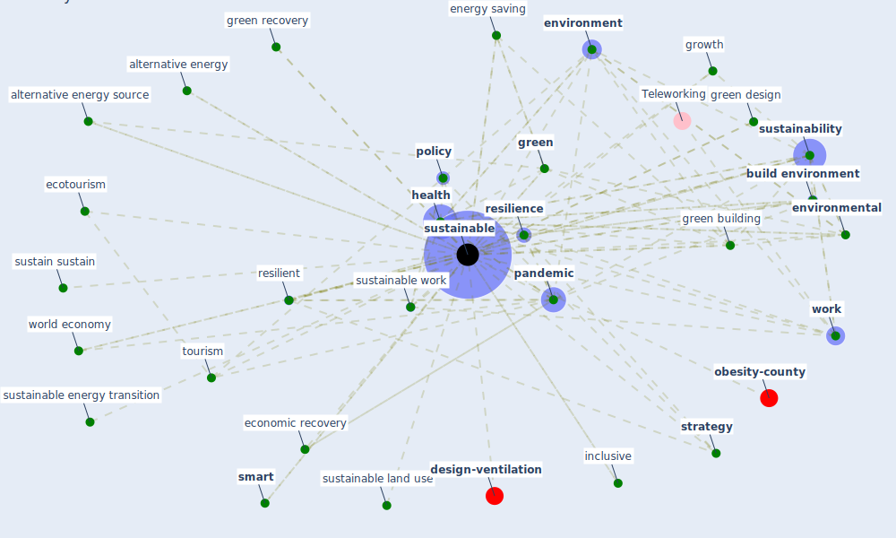

# Keyword: sustainable

* [design-ventilation](cluster_9)

* [obesity-county](cluster_12)

## Keywords

 * alternative energy, alternative energy source, [build environment](keyword_build_environment), [city](keyword_city), [climate change](keyword_climate_change), climate resilient policy, coexistence, [construction](keyword_construction), consumption, [covid-19](keyword_covid-19), definition of sustainable, [design](keyword_design), development, eco friendly, [economic](keyword_economic), economic recovery, economic system, ecotourism, [energy consumption](keyword_energy_consumption), energy saving, [environment](keyword_environment), [environmental](keyword_environmental), environmentally sound, effective, finance, [green](keyword_green), [green building](keyword_green_building), green design, green recovery, growth, habitat iii, [health](keyword_health), inclusive, infrastructure project, [innovative](keyword_innovative), [job](keyword_job), land conservation, land use, life cycle, lifestyle, livable city, organic farming, [pandemic](keyword_pandemic), [policy](keyword_policy), public policy, renewable, renewable energy, renewable material, [resilience](keyword_resilience), resilient, resilient city, resilient infrastructure, resource energy efficient, restoration, reusable resource, [risk](keyword_risk), risk mitigation, s cascone, safe, sensitive, [smart](keyword_smart), [smart city](keyword_smart_city), [social](keyword_social), [society](keyword_society), [strategy](keyword_strategy), supply and production, sustain sustain, [sustainability](keyword_sustainability), [sustainable](keyword_sustainable), sustainable city and community, sustainable design, [sustainable development](keyword_sustainable_development), sustainable development agenda, sustainable employment, [sustainable energy transition](keyword_sustainable_energy_transition), sustainable land use, sustainable tourism, [sustainable work](keyword_sustainable_work), sustainable work throughout the life course, sustainably, [system](keyword_system), [tourism](keyword_tourism), transition management, [transportation](keyword_transportation), unsustainable, urban community, urban development, urban development in uk city, urban green, urban mobility, urban water system, value, water management, [work](keyword_work), work environment, work life, work perspective, workability, [workplace](keyword_workplace), world economy

## Mapping

## Neighbours

### Closest articles

* Sustainable work throughout the life course: National policies and strategies, Publications Office of the European Union - [LINK](article_eurofund_sustainable_2016)
* Urban planning after COVID-19 - [LINK](article_rtpi_urban_2021)
* How COVID-19 Could Accelerate the Adoption of New Retail Technologies and Enhance the (E-)Servicescape - [LINK](article_willems_how_2021)
* COVID-19: IMPACT OF THE PANDEMIC ON THE SUSTAINABLE DEVELOPMENT GOALS - [LINK](article_samout_covid-19_2020)
* COVID-19 Could Leverage a Sustainable Built Environment - [LINK](article_pinheiro_covid-19_2020)
* World Bank Development Report - [LINK](article_world_bank_world_2022)
* How to Make Green Building Certification &amp; Rating Systems More Pandemic-Sustainable? - [LINK](article_ujikawa_how_2022)
* Covid-19 and the politics of sustainable energy transitions - [LINK](article_kuzemko_covid-19_2020)
* Antivirus-built environment: Lessons learned from Covid-19 pandemic - [LINK](article_megahed_antivirus-built_2020)
* Biophilic design in architecture and its contributions to health, well-being, and sustainability: A critical review - [LINK](article_zhong_biophilic_2022)

### Closest BPs

