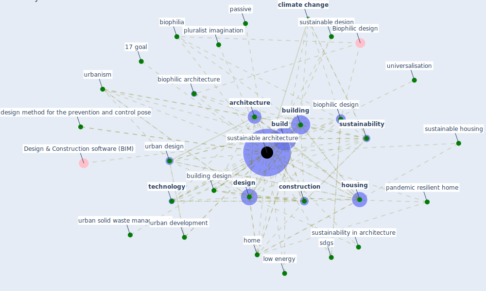

# Keyword: sustainable architecture

## Keywords

 * 17 goal, 17 sdgs, archetype, [architecture](keyword_architecture), benefit of biophilic design, biophilia, [biophilic](keyword_biophilic), biophilic architecture, [biophilic design](keyword_biophilic_design), biophilic design for sustainable architecture, biophilic design goal, [build](keyword_build), [building](keyword_building), building design, [climate change](keyword_climate_change), [construction](keyword_construction), construction process, contemporary architecture, creativity, [design](keyword_design), design approach, design method for the prevention and control pose, goal, health facility design, hide and seek, hide and seek of workspace, [home](keyword_home), [housing](keyword_housing), [indoor air quality](keyword_indoor_air_quality), low energy, pandemic resilient home, passive, pluralist imagination, [sdgs](keyword_sdgs), [sustainability](keyword_sustainability), sustainability in architecture, [sustainable architecture](keyword_sustainable_architecture), sustainable design, sustainable housing, [technology](keyword_technology), universalisation, urban design, urban development, urban solid waste management, [urbanism](keyword_urbanism), workspace

## Mapping

## Neighbours

### Closest articles

* Biophilic design in architecture and its contributions to health, well-being, and sustainability: A critical review - [LINK](article_zhong_biophilic_2022)
* A Review on Building Design as a Biomedical System for Preventing COVID-19 Pandemic - [LINK](article_amran_review_2022)
* Prophylactic Architecture: Formulating the Concept of Pandemic-Resilient Homes - [LINK](article_elrayies_prophylactic_2022)
* Architectural design strategies for infection prevention and control (IPC) in health-care facilities: towards curbing the spread of Covid-19 \textbar SpringerLink - [LINK](article_udomiaye_architectural_2020)
*  - [LINK](article_dalessandro_covid-19_2020)
* Antivirus-built environment: Lessons learned from Covid-19 pandemic - [LINK](article_megahed_antivirus-built_2020)
* Urban planning after COVID-19 - [LINK](article_rtpi_urban_2021)
* Designing a Multi-Agent Occupant Simulation System to Support Facility Planning and Analysis for COVID-19 - [LINK](article_lee_designing_2021)

### Closest BPs

