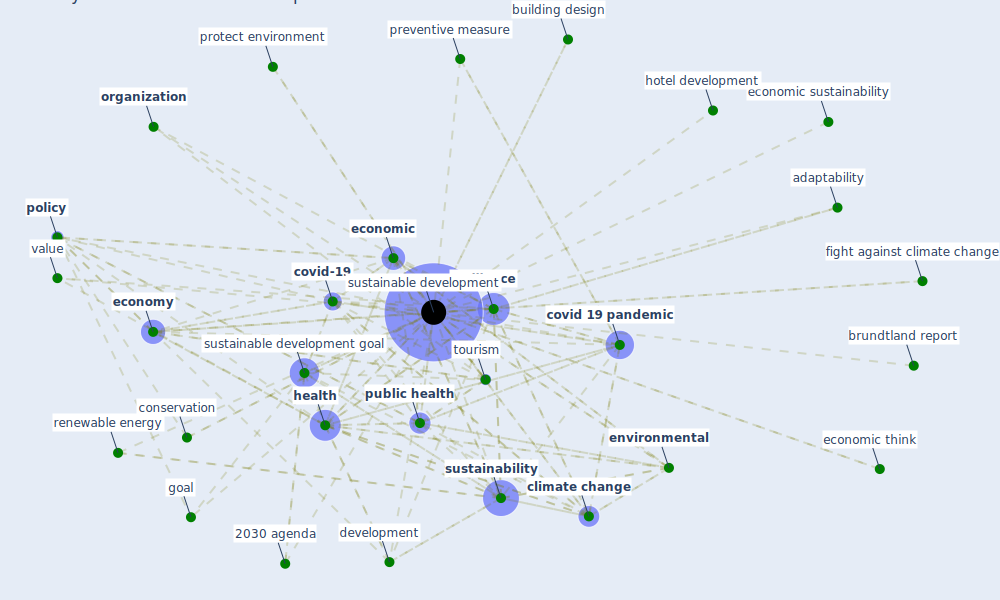

# Keyword: sustainable development

## Keywords

 * 2030 agenda, adaptability, barrier, biophilic architecture, brand equity, brandland report, brundtland report, [build environment](keyword_build_environment), building design, building sector, carbon emission, carbon footprint, ccdr, challengenges of climate change, [city](keyword_city), city planning, civil infrastructure, [climate change](keyword_climate_change), climate change mitigation, [community](keyword_community), concept, conservation, [construction industry](keyword_construction_industry), [covid 19 pandemic](keyword_covid_19_pandemic), [covid-19](keyword_covid-19), daily life circle reconstruction, decouple, development, [digitalisation](keyword_digitalisation), [economic](keyword_economic), economic activity, economic sustainability, economic think, [economy](keyword_economy), enabler, [environment](keyword_environment), [environmental](keyword_environmental), fight against climate change, foli eg, goal, [green](keyword_green), green brand equity, [health](keyword_health), health of a society, hotel development, [housing](keyword_housing), inclusiveness, [infrastructure](keyword_infrastructure), interconnect, ivm, land use, land use efficiency, [mobility](keyword_mobility), naidoo, one health, [organization](keyword_organization), [pandemic resilient indicator](keyword_pandemic_resilient_indicator), past theory, [policy](keyword_policy), population health, post 2015 goals, preventive measure, problem, protect environment, [public health](keyword_public_health), renewable energy, [resilience](keyword_resilience), [sdgs](keyword_sdgs), [social](keyword_social), soft skill, solution network, springerlink, [sustainability](keyword_sustainability), sustainability of development, [sustainable](keyword_sustainable), sustainable building, [sustainable development](keyword_sustainable_development), [sustainable development goal](keyword_sustainable_development_goal), sustainable society, systemic, systemic approach, the pandemic s influence in the dense area, the pillar of sustainable development, the sustainable development goal, theory, [tourism](keyword_tourism), urban value chain, value, [well be](keyword_well_be), who healthy city movement, [work base learn](keyword_work_base_learn)

## Mapping

## Neighbours

### Closest articles

* COVID-19: IMPACT OF THE PANDEMIC ON THE SUSTAINABLE DEVELOPMENT GOALS - [LINK](article_samout_covid-19_2020)
* Strengthening resilience: a priority shared by Health 2020 and - [LINK](article_who_strengthening_2017)
* How COVID-19 Could Accelerate the Adoption of New Retail Technologies and Enhance the (E-)Servicescape - [LINK](article_willems_how_2021)
* Urban Community Sustainable Development Patterns under the Influence of COVID-19: A Case Study Based on the Non-Contact Interaction Perspective of Hangzhou City - [LINK](article_wang_urban_2021)
* COVID-19 Could Leverage a Sustainable Built Environment - [LINK](article_pinheiro_covid-19_2020)
* COVID-19 and Green Housing: A Review of Relevant Literature - [LINK](article_kaklauskas_covid-19_2021)
* A Global Survey of Infection Control and Mitigation Measures for Combating the Transmission of COVID-19 Pandemic in Buildings Under Facilities Management Services - [LINK](article_sarvari_global_2022)
* Antivirus-built environment: Lessons learned from Covid-19 pandemic - [LINK](article_megahed_antivirus-built_2020)
* Urban planning after COVID-19 - [LINK](article_rtpi_urban_2021)
* Biophilic design in architecture and its contributions to health, well-being, and sustainability: A critical review - [LINK](article_zhong_biophilic_2022)

### Closest BPs

