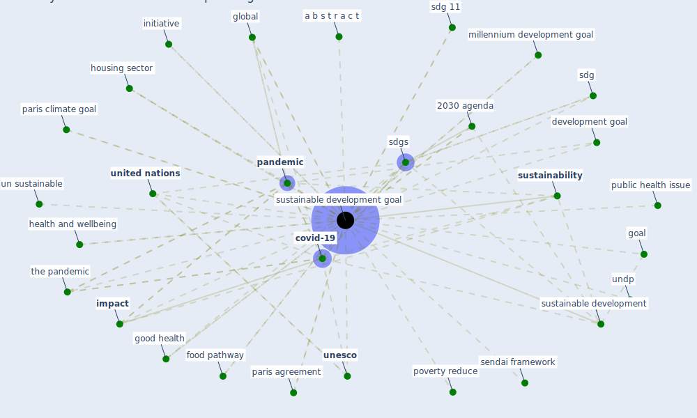

# Keyword: sustainable development goal

## Keywords

 * 17 sustainable development goal, 2030 agenda, 2030 un agenda for sustainable development, a b s t r a c t, [africa](keyword_africa), agenda, agenda 21, biophilic architecture, budget, [climate change](keyword_climate_change), copenhagen, [covid-19](keyword_covid-19), development goal, eradicate, eradicate poverty, [europe](keyword_europe), food pathway, francesco fuso nerini, global, globally, goal, good health, [health](keyword_health), health and wellbeing, [health care](keyword_health_care), housing sector, [impact](keyword_impact), initiative, knowledge platform, kyoto protocol, last partnership, millennium development goal, nastis, no hunger, no poverty, non environmental, one health, [pandemic](keyword_pandemic), pandemic world, paris agreement, paris climate goal, post 2015 goals, poverty, poverty alleviation, poverty reduce, public health issue, sdg, sdg 11, [sdgs](keyword_sdgs), search for sustainable development goal, sendai framework, solidarity action, [sustainability](keyword_sustainability), [sustainable development](keyword_sustainable_development), [sustainable development goal](keyword_sustainable_development_goal), sustainable development goals, [technology](keyword_technology), technology and innovation, the pandemic, [tourism](keyword_tourism), town planning, un 17, un sustainable, un sustainable building, undp, [unesco](keyword_unesco), united nation, united nation s, [united nations](keyword_united_nations), united nations development programme, [world bank](keyword_world_bank), world bank group, worldgbc

## Mapping

## Neighbours

### Closest articles

* COVID-19: IMPACT OF THE PANDEMIC ON THE SUSTAINABLE DEVELOPMENT GOALS - [LINK](article_samout_covid-19_2020)
* How COVID-19 Redefines the Concept of Sustainability - [LINK](article_hakovirta_how_2020)
* Urban planning after COVID-19 - [LINK](article_rtpi_urban_2021)
* Building sustainable finance for resilient protected and conserved areas: lessons from COVID-19 - [LINK](article_cumming_building_2021)
* Sustainable work throughout the life course: National policies and strategies, Publications Office of the European Union - [LINK](article_eurofund_sustainable_2016)
* Decision Making within the Built Environment as a Strategy for Mitigating the Risk of Malaria and Other Vector-Borne Diseases - [LINK](article_obonyo_decision_2018)
* Digital Twin of COVID-19 Mass Vaccination Centers - [LINK](article_pilati_digital_2021)
* World Bank Development Report - [LINK](article_world_bank_world_2022)
* Strengthening resilience: a priority shared by Health 2020 and - [LINK](article_who_strengthening_2017)
* How is COVID-19 Experience Transforming Sustainability Requirements of Residential Buildings? A Review - [LINK](article_tokazhanov_how_2020)

### Closest BPs

