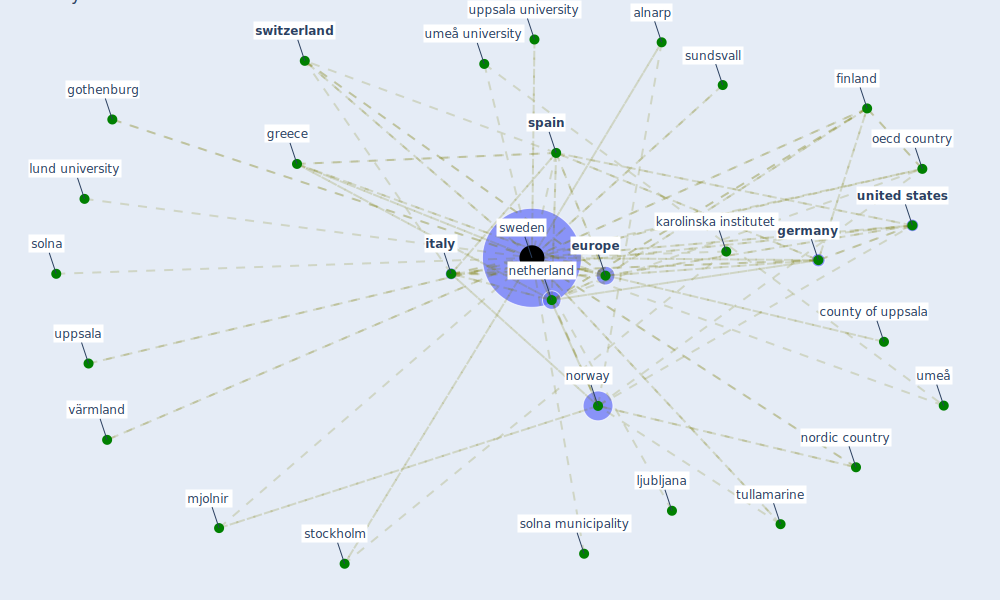

# Keyword: sweden

## Keywords

 * a review of the key factors, aalborg university, afrika tv, alnarp, [austria](keyword_austria), childcare service, coronamadrid, [country](keyword_country), county of uppsala, [covid 19 pandemic](keyword_covid_19_pandemic), [crisis](keyword_crisis), culture, [denmark](keyword_denmark), duality in employment protection, duality in employment protection in sweden, effect of the covid 19 pandemic on population mobility under mild policy, eisen l, enr, eukarenna, [europe](keyword_europe), european, european centre for disease prevention and control, european country, eurostat, family life, [finland](keyword_finland), first wave, [foreign bear](keyword_foreign_bear), [germany](keyword_germany), gothenburg, government office of sweden, greece, gössle, habsburg dynasty, halden, hjaltland, [italy](keyword_italy), job security council, karolinska institutet, lapland, ljubljana, loan grant system, lund university, malmo, mjolnir, mjordt, [netherland](keyword_netherland), nordic country, norway, når, [oecd](keyword_oecd), oecd country, oslofjord, petersson e, prevent, prevent initiative, prevent programme, på på, replacement rate for sickness benefit, samarium, [se](keyword_se), se se, se sel, sickness benefit, solna, solna municipality, somalia, [spain](keyword_spain), st petersburg, stockholm, stockholm county council, stockholm resiliencecentre, sundhedsstyrelsen, sundsvall, [sustainable work](keyword_sustainable_work), [sweden](keyword_sweden), swedish labour market legislation, swisscovid, [switzerland](keyword_switzerland), system of childcare service, tbe, the crisis, trygghetsråd, tullamarine, tyskland, tønsberg, umeå, umeå university, [united kingdom](keyword_united_kingdom), [united states](keyword_united_states), upper secondary school, uppsala, uppsala university, vaterlände, värmland, äå é, år år, århundrede, åå, åå é

## Mapping

## Neighbours

### Closest articles

* Sustainable work throughout the life course: National policies and strategies, Publications Office of the European Union - [LINK](article_eurofund_sustainable_2016)
* Making green infrastructure healthier infrastructure - [LINK](article_lohmus_making_2015)
* What has been the impact of the COVID-19 pandemic on immigrants? An update on recent evidence - [LINK](article_oecd_what_2022)
* Refleksioner fra en pandemi - [LINK](article_realdania_refleksioner_2022)
* Green in times of COVID-19: urban green space relevance during the COVID-19 pandemic in Buenos Aires City - [LINK](article_marconi_green_2022)
* 2020 Data Protection Report - [LINK](article_council_of_europe_2020_2020)
* Covid-19 and asset management in EU: a preliminary assessment of performance and investment styles - [LINK](article_rizvi_covid-19_2020)
* Pandemiens arkitektur - [LINK](article_realdania_pandemiens_2022)
* Attitudes towards outdoor and neighbour noise during the COVID-19 lockdown: A case study in London - [LINK](article_lee_attitudes_2021)
* Coronavirus questions that will not go away: interrogating urban and socio-spatial implications of COVID-19 measures - [LINK](article_salama_coronavirus_2020)

### Closest BPs

