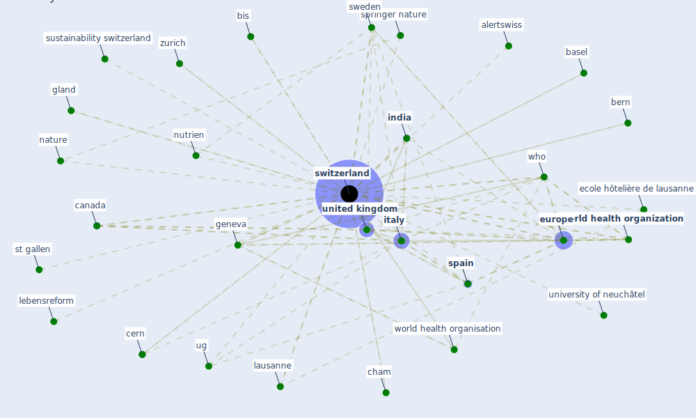

# Keyword: switzerland

## Keywords

 * ag sustainability, alertswiss, amazona, art basel, [austria](keyword_austria), b c h, basel, bc h, bern, bis, [canada](keyword_canada), cern, cern university, cham, cornell university, coronavirus covid 19 pandemic in france and switzerland, country affect by novel coronavirus, [covid 19 pandemic](keyword_covid_19_pandemic), ecole hôtelière de lausanne, eth zurich, eth zurich research collection, [europe](keyword_europe), federalism, flood resilience alliance, fsb, geneva, genova, geography, geoscience, gland, [india](keyword_india), iqair airvisual, [italy](keyword_italy), iucn, lausanne, lebensreform, lusail, [market](keyword_market), [nature](keyword_nature), neisser, nuadlodge, nutrien, salvatori, [spain](keyword_spain), springer nature, st gallen, sustainability switzerland, sustainability switzerland 12 12, [sweden](keyword_sweden), [switzerland](keyword_switzerland), switzerland who, [ug](keyword_ug), [united kingdom](keyword_united_kingdom), united nations conference on trade and development, universelle, university of neuchâtel, university of the west of england, university of zurich, who, world health organisation, [world health organization](keyword_world_health_organization), zurich, zurich university of apply science, école polytechnique fédérale de lausanne

## Mapping

## Neighbours

### Closest articles

* World Bank Development Report - [LINK](article_world_bank_world_2022)
* On the Coronavirus (COVID-19) Outbreak and the Smart City Network: Universal Data Sharing Standards Coupled with Artificial Intelligence (AI) to Benefit Urban Health Monitoring and Management - [LINK](article_allam_coronavirus_2020)
* How COVID-19 Could Accelerate the Adoption of New Retail Technologies and Enhance the (E-)Servicescape - [LINK](article_willems_how_2021)
* Health, Economic and Social Development Challenges of the COVID-19 Pandemic: Strategies for Multiple and Interconnected Issues - [LINK](article_panneer_health_2022)
* A Platform for Citizen Cooperation during the COVID-19 Pandemic in RN, Brazil - [LINK](article_de_araujo_platform_2020)
* COVID-19 Could Leverage a Sustainable Built Environment - [LINK](article_pinheiro_covid-19_2020)
* A critical analysis of the impacts of COVID-19 on the global economy and ecosystems and opportunities for circular economy strategies - [LINK](article_ibn-mohammed_critical_2021)
* Covid-19 and asset management in EU: a preliminary assessment of performance and investment styles - [LINK](article_rizvi_covid-19_2020)
* A Comprehensive Review of the COVID-19 Pandemic and the Role of IoT, Drones, AI, Blockchain, and 5G in Managing its Impact - [LINK](article_chamola_comprehensive_2020)
* A Review on Building Design as a Biomedical System for Preventing COVID-19 Pandemic - [LINK](article_amran_review_2022)

### Closest BPs

