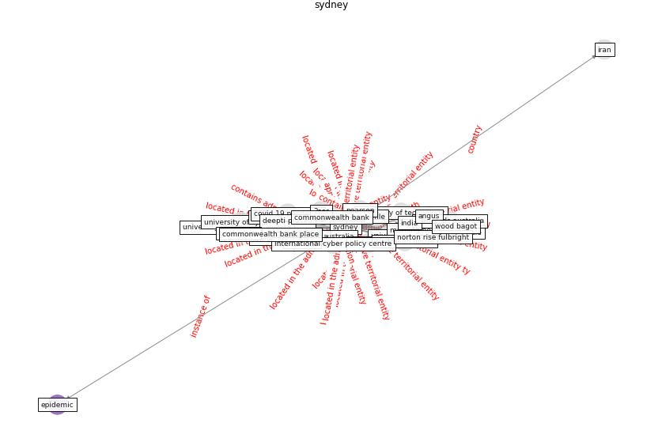

# Keyword: sydney

* [podcast-audio](cluster_Cluster_7)

## Keywords

 * 2ser, Cluster_7, afield, angus, aus, [australia](keyword_australia), australian house, australian strategic policy institute, bank place, city road, commonwealth bank, commonwealth bank place, [covid 19 pandemic](keyword_covid_19_pandemic), deepti prasad, [epidemic](keyword_epidemic), [india](keyword_india), investa, iran, kurt iveson, morning herald, morningherald, [new south wale](keyword_new_south_wale), norton rise fulbright, nsw, pearson, publichouse, publichouse redevelopment in sydney, rohle, standards australia, [sydney](keyword_sydney), tooran alizadeh, university of new south wale, university of sydney, university of technology, wood bagot

## Concepts

 

## Neighbours

### Closest articles

* The City Under COVID‐19: Podcasting As Digital Methodology - [LINK](article_rogers_city_2020)
* RESIDENTIAL ARCHITECTURE IN A POST-PANDEMIC WORLD: IMPLICATIONS OF COVID-19 FOR NEW CONSTRUCTION AND FOR ADAPTING HERITAGE BUILDINGS - [LINK](article_spennemann_residential_2021)
* COVID-19 could be a seasonal illness with higher risk in winter: Reduced humidity linked to increased COVID-19 risk - [LINK](article_university_of_sydney_covid-19_2020)
* Continuous IEQ monitoring system: Context and development - [LINK](article_parkinson_continuous_2019)
* First confirmed detection of SARS-CoV-2 in untreated wastewater in Australia: A proof of concept for the wastewater surveillance of COVID-19 in the community - [LINK](article_ahmed_first_2020)
* Health, Wellbeing \& Productivity in Offices - [LINK](article_world_green_building_council_health_2014)
* The COVID-19 pandemic: Lessons on building more equal and sustainable societies - [LINK](article_van_barneveld_covid-19_2020)
* Respiratory pandemics, urban planning and design: A multidisciplinary rapid review of the literature - [LINK](article_harris_respiratory_2022)
* Future (post-COVID) digital, smart and sustainable cities in the wake of 6G: Digital twins, immersive realities and new urban economies - [LINK](article_allam_future_2021)
* Urban Green Infrastructure and Green Open Spaces: An Issue of Social Fairness in Times of COVID-19 Crisis - [LINK](article_reinwald_urban_2021)

### Closest BPs

