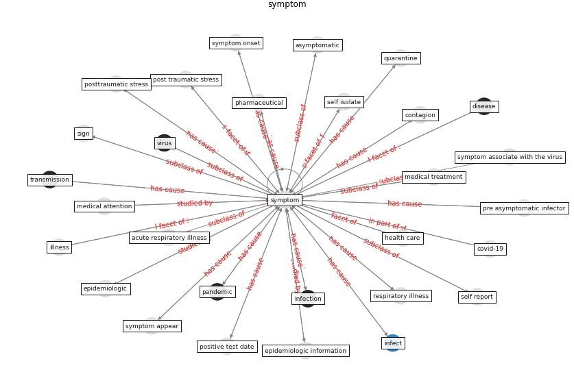

# Keyword: __symptom__

## Concepts

 

## Top articles for __symptom__
* Analysis of COVID-19 Concerns Raised by the
Construction Workforce and Development of
Mitigation Practices ([bou_hatoum_analysis_2021](article_bou_hatoum_analysis_2021))
* COVID-19 media fatigue: predictors of decreasing
interest and avoidance of COVID-19–related news ([buneviciene_covid-19_2021](article_buneviciene_covid-19_2021))
* pfefferbaum_mental_2020 ([pfefferbaum_mental_2020](article_pfefferbaum_mental_2020))
* pfefferbaum_mental_2020 ([pfefferbaum_mental_2020](article_pfefferbaum_mental_2020))
* SARS-CoV-2 in wastewater: potential health risk, but
also data source ([lodder_sars-cov-2_2020](article_lodder_sars-cov-2_2020))
* Digital technology and COVID-19 ([ting_digital_2020](article_ting_digital_2020))
