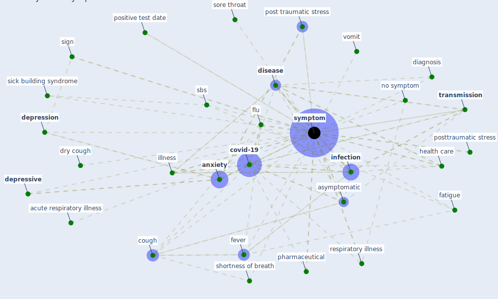

# Keyword: symptom

## Keywords

 * acute respiratory illness, allergy, [anxiety](keyword_anxiety), anxiety symptom, anxious symptomatology, ards, asymptomatic, asymptomatic infection, asymptomatic phase, body ache, build syndrome, chill, cold, contagion, coronavirus body symptom, cough, [covid-19](keyword_covid-19), cumulative infection, death, [depression](keyword_depression), [depressive](keyword_depressive), [depressive symptom](keyword_depressive_symptom), diagnose, diagnosis, [disease](keyword_disease), dizziness, dry cough, epidemiologic, epidemiologic information, fatigue, febrile, feeling of fatigue, feeling unwell, [fever](keyword_fever), flu, headache, [health care](keyword_health_care), health questionnaire, hospitalization, illness, incubation period, infect, [infection](keyword_infection), [infectious disease](keyword_infectious_disease), [influenza](keyword_influenza), insomnia, mild symptom, nausea, no symptom, [pandemic](keyword_pandemic), pharmaceutical, [pollen](keyword_pollen), positive test date, [post traumatic stress](keyword_post_traumatic_stress), posttraumatic stress, pre asymptomatic infector, pre symptomatic, [prevention](keyword_prevention), ptsd, respiratory illness, runny nose, runny or stuffy nose, sbs, self diagnosis, self isolate, self report, self report symptom, severe, severe symptom, shortness of breath, show symptom, sick building syndrome, sick building syndrome in mauritius, [sign](keyword_sign), sign and or symptom associate with the coronavirus, sign and symptom, sign of a fever, significant, silva, simple symptom, smedje, sneeze, sore throat, [stress](keyword_stress), [symptom](keyword_symptom), symptom appear, symptom do you have, symptom onset, symptomatic, symptomless, test, tiredness, [transmission](keyword_transmission), transmit the virus, [travel](keyword_travel), [virus](keyword_virus), vocs concentration level, vomit, [well be](keyword_well_be), work productivity

## Mapping

## Neighbours

### Closest articles

* Psychological Effects of Home Confinement and Social Distancing Derived from COVID-19 in the General Population—A Systematic Review - [LINK](article_rodriguez-fernandez_psychological_2021)
* Analysis of COVID-19 Concerns Raised by the Construction Workforce and Development of Mitigation Practices - [LINK](article_bou_hatoum_analysis_2021)
* Occupant health in buildings: Impact of the COVID-19 pandemic on the opinions of building professionals and implications on research - [LINK](article_awada_occupant_2022)
* Risk Diagnosis and Mitigation System of COVID-19 Using Expert System and Web Scraping - [LINK](article_mufid_risk_2020)
* COVID-19 Pandemic: Prevention and Protection Measures to Be Adopted at the Workplace - [LINK](article_cirrincione_covid-19_2020)
* Mobile Technology Solution for COVID-19: Surveillance and Prevention - [LINK](article_raza_mobile_2021)
*  - [LINK](article_mehtab_alam_role_2021)
* The psychological impact of COVID-19 on the mental health in the general population - [LINK](article_serafini_psychological_2020)
* A comprehensive review on indoor air quality monitoring systems for enhanced public health - [LINK](article_saini_comprehensive_2020)
* A Comprehensive Review of the COVID-19 Pandemic and the Role of IoT, Drones, AI, Blockchain, and 5G in Managing its Impact - [LINK](article_chamola_comprehensive_2020)

### Closest BPs

