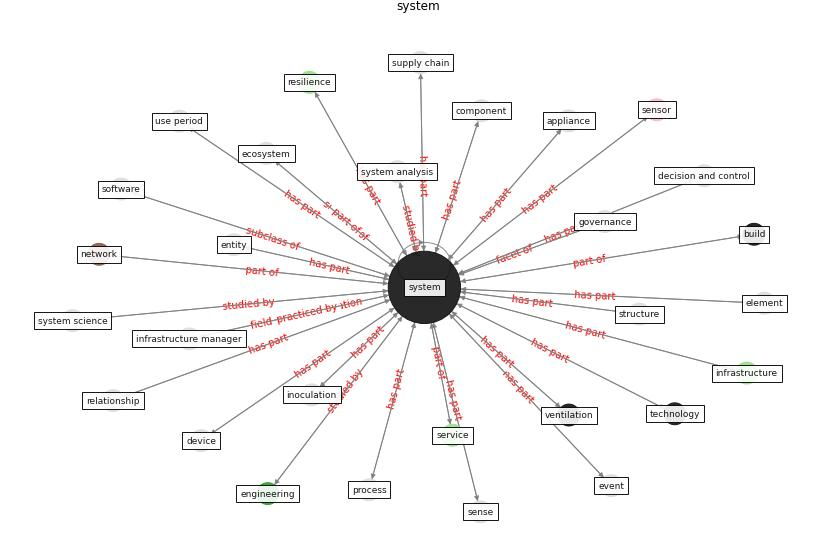

# Keyword: __system__
## Clusters

* Cluster 0: [air-sars](cluster_0)
* Cluster 2: [uv-room](cluster_2)
* Cluster 9: [health-building](cluster_9)
* Cluster 11: [blockchain-ai](cluster_11)
* Cluster 14: [resilience-system](cluster_14)

## Concepts

 

## Top 10 articles for __system__
* A review of definitions and measures of system
resilience ([hosseini_review_2016](article_hosseini_review_2016))
* oecd_guidelines_2014 ([oecd_guidelines_2014](article_oecd_guidelines_2014))
* Addressing the impact of COVID-19 lockdown on energy use
in municipal buildings: A case study in Florianópolis,
Brazil ([geraldi_addressing_2021](article_geraldi_addressing_2021))
* who_strengthening_2017 ([who_strengthening_2017](article_who_strengthening_2017))
* Digital Twin of COVID-19 Mass Vaccination
Centers ([pilati_digital_2021](article_pilati_digital_2021))
* Learning from pandemics: Applying resilience thinking to
identify priorities for planning urban settlements ([syal_learning_2021](article_syal_learning_2021))
* A comprehensive review on indoor air quality monitoring
systems for enhanced public health ([saini_comprehensive_2020](article_saini_comprehensive_2020))
* COVID-19 Could Leverage a Sustainable Built
Environment ([pinheiro_covid-19_2020](article_pinheiro_covid-19_2020))
* Towards the sustainable development of smart cities
through mass video surveillance: A response to the
COVID-19 pandemic ([shorfuzzaman_towards_2021](article_shorfuzzaman_towards_2021))
* carvalhaes_covid-19_2020 ([carvalhaes_covid-19_2020](article_carvalhaes_covid-19_2020))
