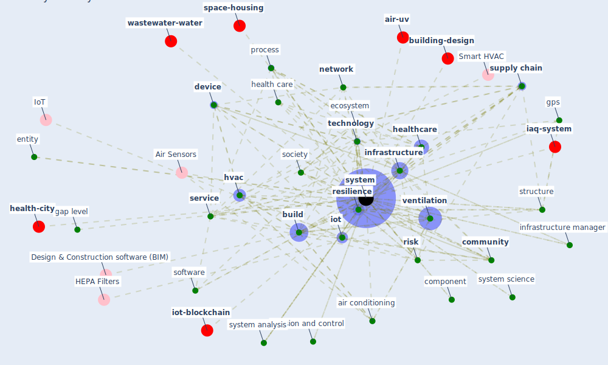

# Keyword: system

* [health-city](cluster_0)

* [space-housing](cluster_1)

* [wastewater-water](cluster_3)

* [building-design](cluster_4)

* [iot-blockchain](cluster_5)

* [air-uv](cluster_7)

* [iaq-system](cluster_10)

## Keywords

 * absenteeism, [air conditioning](keyword_air_conditioning), air recirculation, [algorithm](keyword_algorithm), antivirus, appliance, assembly system, asset, automate checkout, backup capability, biofiltration, block diagram, borehole, [build](keyword_build), [building](keyword_building), challenge, [community](keyword_community), complexity, component, control system, [dataset](keyword_dataset), decision, decision and control, decision make, [device](keyword_device), diagnostic test, difference equation system, [drone](keyword_drone), dry air purification, earthquake, [ecosystem](keyword_ecosystem), element, elemental, energy system, [engineering](keyword_engineering), entity, equipment, event, functionality, [gap level](keyword_gap_level), governance, [gps](keyword_gps), [health](keyword_health), [health care](keyword_health_care), [health system](keyword_health_system), [healthcare](keyword_healthcare), heat exchanger, [human](keyword_human), [hvac](keyword_hvac), [infrastructure](keyword_infrastructure), infrastructure manager, infrastructure network, inoculation, insolvency, insolvency system, integrate, [interdependency](keyword_interdependency), [iot](keyword_iot), iot system, it hardware, [method](keyword_method), [monitor](keyword_monitor), [network](keyword_network), [object detection](keyword_object_detection), performance, piping, [plan](keyword_plan), power consumption, primary healthcare, process, public transportation, question, [relationship](keyword_relationship), [resilience](keyword_resilience), resilient, resource, ride sharing, [risk](keyword_risk), rule base system, sense, [sensor](keyword_sensor), [service](keyword_service), service provision, [sewage](keyword_sewage), [shock](keyword_shock), [society](keyword_society), software, structure, [supply chain](keyword_supply_chain), sustainable livelihood, sustainable system, [system](keyword_system), [system analysis](keyword_system_analysis), system science, system theoretic, [technology](keyword_technology), transformative, turn on, use period, [ventilation](keyword_ventilation)

## Mapping

## Neighbours

### Closest articles

* A review of definitions and measures of system resilience - [LINK](article_hosseini_review_2016)
* Guidelines for resilience systems analysis - [LINK](article_oecd_guidelines_2014)
* Addressing the impact of COVID-19 lockdown on energy use in municipal buildings: A case study in Florianópolis, Brazil - [LINK](article_geraldi_addressing_2021)
* Strengthening resilience: a priority shared by Health 2020 and - [LINK](article_who_strengthening_2017)
* Digital Twin of COVID-19 Mass Vaccination Centers - [LINK](article_pilati_digital_2021)
* Preparing critical infrastructure for the future: Lessons learnt from the Covid-19 pandemic - [LINK](article_tomalska_preparing_2022)
* A comprehensive review on indoor air quality monitoring systems for enhanced public health - [LINK](article_saini_comprehensive_2020)
* Learning from pandemics: Applying resilience thinking to identify priorities for planning urban settlements - [LINK](article_syal_learning_2021)
* Addressing vulnerability, building resilience: community-based adaptation to vector-borne diseases in the context of global change - [LINK](article_bardosh_addressing_2017)
* A critical review of heating, ventilation, and air conditioning (HVAC) systems within the context of a global SARS-CoV-2 epidemic - [LINK](article_elsaid_critical_2021)

### Closest BPs

