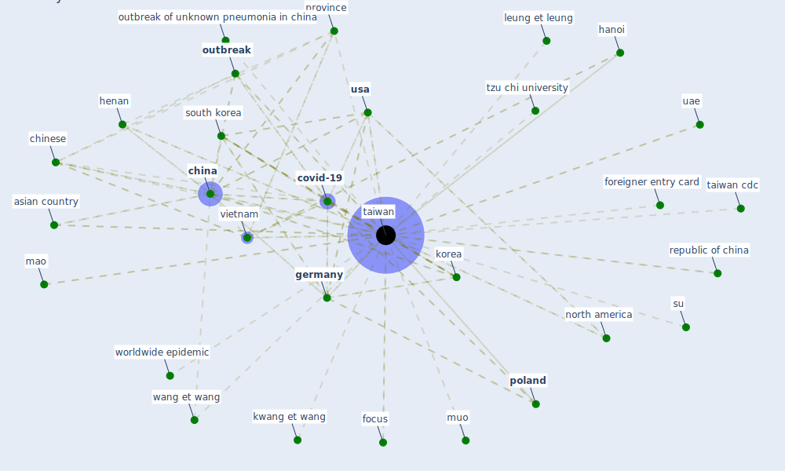

# Keyword: taiwan

## Keywords

 * 10th high case number among country affect thus far, 12 most polluted, 2003 sar outbreak, 2009 h1n1 outbreak, [airport](keyword_airport), anti sar quarantine, [artificial intelligence](keyword_artificial_intelligence), asian country, ba ba, [big datum](keyword_big_datum), brook r wang c, c brook, c ng, c wang, [cdc](keyword_cdc), cecc, center for disease control, chen peng chenb, [china](keyword_china), [chinese](keyword_chinese), christian daugthon, citizen household registration system, coffee, coffee yarn, [coronavirus](keyword_coronavirus), coronavirus case, [country](keyword_country), country affect thus far, covid 19 outbreak, [covid-19](keyword_covid-19), diamond princess cruise ship, early intervention by taiwan, electronic fence, emergency department, entry quarantine system, f c, fao, first covid 19 wave, focus, foreigner entry card, [germany](keyword_germany), ha, hainan, han hsi lianga, hanoi, henan, hi hi, international, iran, island, [japan](keyword_japan), kibo, [korea](keyword_korea), kwang et wang, kwok, leung et leung, mao, muo, new coronavirus case, new electronic fence for quarantine, [north america](keyword_north_america), [outbreak](keyword_outbreak), outbreak of unknown pneumonia in china, [pandemic](keyword_pandemic), [poland](keyword_poland), [province](keyword_province), public opinion foundation, r h brook, republic of china, sewage epidemiology indicator christian daugthon, [south korea](keyword_south_korea), starbuck, su, su su, [taiwan](keyword_taiwan), taiwan cdc, taiwan cdc website, tema, test and trace, test and trace system, tui, tuik, tzu chi, tzu chi university, uae, [usa](keyword_usa), vietnam, wang et wang, worldwide epidemic, wuhu

## Mapping

## Neighbours

### Closest articles

* Response to COVID-19 in Taiwan - [LINK](article_wang_response_2020)
*  - [LINK](article_mehtab_alam_role_2021)
* Pandemic Analytics: How Countries are Leveraging Big Data Analytics and Artificial Intelligence to Fight COVID-19? - [LINK](article_mehta_pandemic_2021)
* COVID-19 Higher Mortality in Chinese Regions With Chronic Exposure to Lower Air Quality - [LINK](article_pansini_covid-19_2021)
* Blockchain technology and its applications to combat COVID-19 pandemic - [LINK](article_sharma_blockchain_2022)
* How COVID-19 Could Accelerate the Adoption of New Retail Technologies and Enhance the (E-)Servicescape - [LINK](article_willems_how_2021)
* Startups in times of crisis – A rapid response to the COVID-19 pandemic - [LINK](article_kuckertz_startups_2020)
* Impact of COVID-19 on IoT Adoption in Healthcare, Smart Homes, Smart Buildings, Smart Cities, Transportation and Industrial IoT - [LINK](article_umair_impact_2021)
* COVID-19 Prevention and Control Measures in Workplace Settings: A Rapid Review and Meta-Analysis - [LINK](article_ingram_covid-19_2021)
* An Intelligent IEQ Monitoring and Feedback System: Development and Applications - [LINK](article_geng_intelligent_2021)

### Closest BPs

