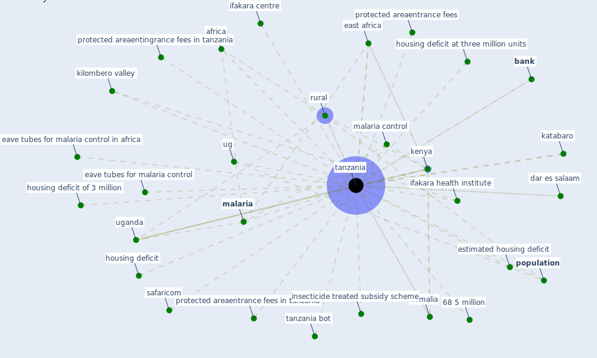

# Keyword: tanzania

## Keywords

 * 68 5 million, [africa](keyword_africa), [bank](keyword_bank), dar es salaam, dodoma, east africa, eave tubes for malaria control, eave tubes for malaria control in africa, estimated housing deficit, housing deficit, housing deficit at three million units, housing deficit of 3 million, ifakara centre, ifakara health institute, insecticide treated subsidy scheme, katabaro, [kenya](keyword_kenya), kilombero valley, [malaria](keyword_malaria), malaria control, [population](keyword_population), protected areaentingrance fees in tanzania, protected areaentrance fees, protected areaentrance fees in tanzania, rural, safaricom, somalia, [tanzania](keyword_tanzania), tanzania bot, [ug](keyword_ug), uganda, underdeveloped

## Mapping

## Neighbours

### Closest articles

* Decision Making within the Built Environment as a Strategy for Mitigating the Risk of Malaria and Other Vector-Borne Diseases - [LINK](article_obonyo_decision_2018)
* Addressing vulnerability, building resilience: community-based adaptation to vector-borne diseases in the context of global change - [LINK](article_bardosh_addressing_2017)
* World Bank Development Report - [LINK](article_world_bank_world_2022)
* The impact of climate change on the epidemiology and control of Rift Valley fever - PubMed - [LINK](article_martin_impact_2008)
* Occupant health in buildings: Impact of the COVID-19 pandemic on the opinions of building professionals and implications on research - [LINK](article_awada_occupant_2022)
* Building sustainable finance for resilient protected and conserved areas: lessons from COVID-19 - [LINK](article_cumming_building_2021)
* COVID-19 risks and systemic gaps in Nigeria: resilience building lessons for pandemic and climate change management - [LINK](article_lawal_covid-19_2022)
* Green in times of COVID-19: urban green space relevance during the COVID-19 pandemic in Buenos Aires City - [LINK](article_marconi_green_2022)

### Closest BPs

