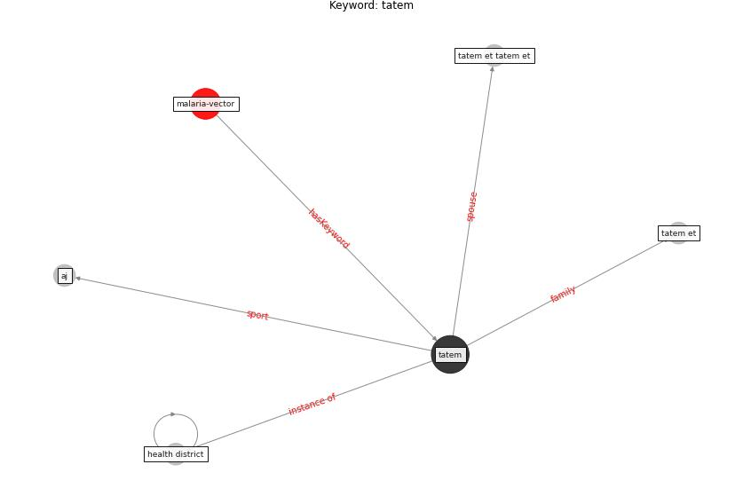

# Keyword: tatem

* [malaria-vector](cluster_Cluster_12)

## Keywords

 * Cluster_12, aj, health district, [tatem](keyword_tatem), tatem et, tatem et tatem et

## Concepts

 

## Neighbours

### Closest articles

* Integrating rapid risk mapping and mobile phone call record data for strategic malaria elimination planning - [LINK](article_tatem_integrating_2014)
* Addressing vulnerability, building resilience: community-based adaptation to vector-borne diseases in the context of global change - [LINK](article_bardosh_addressing_2017)

### Closest BPs

