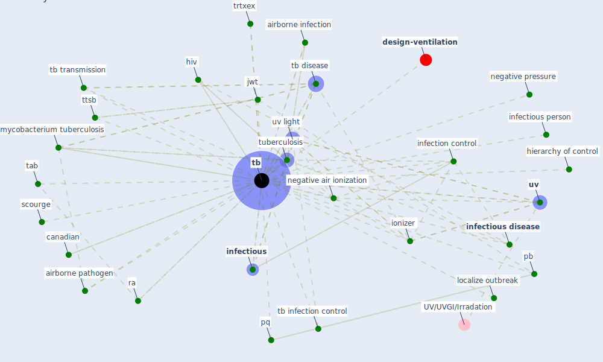

# Keyword: tb

* [uv-air](cluster_15)

## Keywords

 * Cluster_15, [airborne infection](keyword_airborne_infection), airborne pathogen, b tb disease, canadian, [disease](keyword_disease), drug susceptibility assay, dsðt, hierarchy of control, [hiv](keyword_hiv), hiv aid, [infection control](keyword_infection_control), infectious, [infectious disease](keyword_infectious_disease), infectious person, [ionizer](keyword_ionizer), [jwt](keyword_jwt), localize outbreak, mycobacterium tuberculosis, negative air ionization, negative pressure, [pb](keyword_pb), pq, ra, scourge, tab, [tb](keyword_tb), tb disease, tb infection control, tb transmission, trtxex, ttsb, [tuberculosis](keyword_tuberculosis), [uv](keyword_uv), [uv light](keyword_uv_light), ztt

## Mapping

## Neighbours

### Closest articles

* Upper-Room Ultraviolet Light and Negative Air Ionization to Prevent Tuberculosis Transmission - [LINK](article_escombe_upper-room_2009)
* A Platform for Citizen Cooperation during the COVID-19 Pandemic in RN, Brazil - [LINK](article_de_araujo_platform_2020)
* Air Disinfection for Airborne Infection Control with a Focus on COVID‐19: Why Germicidal UV is Essential             † - [LINK](article_nardell_air_2021)
* Applications of ultraviolet germicidal irradiation disinfection in health care facilities: Effective adjunct, but not stand-alone technology - [LINK](article_memarzadeh_applications_2010)
* A Review on Building Design as a Biomedical System for Preventing COVID-19 Pandemic - [LINK](article_amran_review_2022)
* Upper-room ultraviolet air disinfection might help to reduce COVID-19 transmission in buildings: a feasibility study - [LINK](article_beggs_upper-room_2020)
* Environmental factors involved in SARS-CoV-2 transmission: effect and role of indoor environmental quality in the strategy for COVID-19 infection control - [LINK](article_azuma_environmental_2020)
* Epidemics, Planning and the City: A Special Issue of Planning Perspectives - [LINK](article_davis_epidemics_2022)
* A review of definitions and measures of system resilience - [LINK](article_hosseini_review_2016)

### Closest BPs

