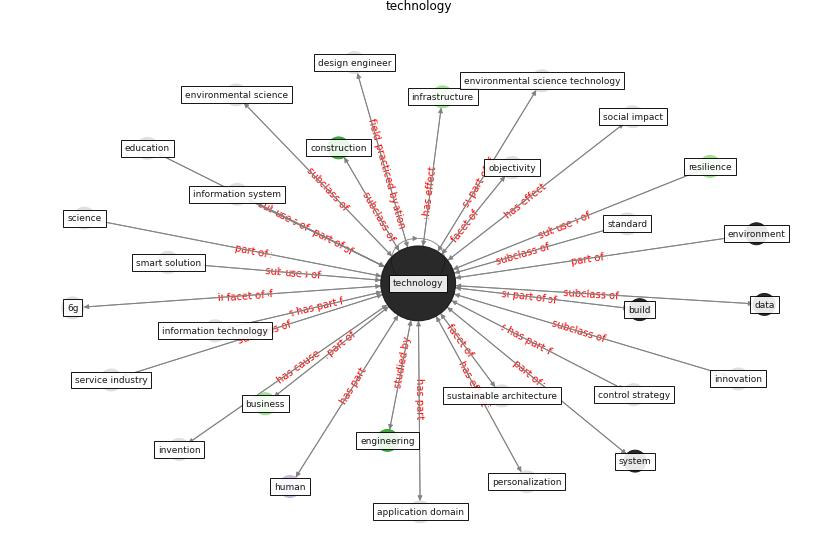

# Keyword: technology

* [city-urban](cluster_Cluster_1)

* [datum-ai](cluster_Cluster_7)

## Keywords

 * [5 g](keyword_5_g), [6 g](keyword_6_g), appliance, [architecture](keyword_architecture), [artificial intelligence](keyword_artificial_intelligence), autonomous vehicle, [big datum](keyword_big_datum), [blockchain](keyword_blockchain), [build](keyword_build), [business](keyword_business), caption app, city and the digital revolution, [construction](keyword_construction), construction 4 0, control strategy, [covid-19](keyword_covid-19), [customer](keyword_customer), [datum](keyword_datum), datum science, [development](keyword_development), device, [digital](keyword_digital), digital app, digital learning, digital revolution, digital skill, digital tooling, [digital transformation](keyword_digital_transformation), distance communication, driver, [education](keyword_education), [engineering](keyword_engineering), [environment](keyword_environment), environmental science, equipment, [filter](keyword_filter), food science, future of work, [human](keyword_human), immune building system, [impact](keyword_impact), [industry](keyword_industry), infancy stage, information, information system, information technology, [infrastructure](keyword_infrastructure), [innovation](keyword_innovation), innovative solution, integrate, interface, [internet](keyword_internet), internet of thing, invention, [iot](keyword_iot), kitchen, [knowledge](keyword_knowledge), knowledge base, [machine learning](keyword_machine_learning), mobile application, objectivity, online retailing, operator, [pandemic](keyword_pandemic), [personalization](keyword_personalization), [protocol](keyword_protocol), reimagine, [research](keyword_research), [resilience](keyword_resilience), science, self service, service industry, [smart city](keyword_smart_city), smart smart solution, smart solution, smart technology, smartphone, social impact, [social medium](keyword_social_medium), solution, [standard](keyword_standard), [sustainable architecture](keyword_sustainable_architecture), [system](keyword_system), technological potential, [technology](keyword_technology), technology here, technology review, touch versus tech, touchless, ultraviolet germicidal irradiation, urban sensing, [uv](keyword_uv), virtual communication, virtualisation, voice control, voice detection, wearable, webshop, what be information technology, wireless

## Concepts

 

## Neighbours

### Closest articles

* How COVID-19 Could Accelerate the Adoption of New Retail Technologies and Enhance the (E-)Servicescape - [LINK](article_willems_how_2021)
* Future (post-COVID) digital, smart and sustainable cities in the wake of 6G: Digital twins, immersive realities and new urban economies - [LINK](article_allam_future_2021)
* Contributions of Smart City Solutions and Technologies to Resilience against the COVID-19 Pandemic: A Literature Review - [LINK](article_sharifi_contributions_2021)
* Blockchain technology and its applications to combat COVID-19 pandemic - [LINK](article_sharma_blockchain_2022)
* Pandemic Analytics: How Countries are Leveraging Big Data Analytics and Artificial Intelligence to Fight COVID-19? - [LINK](article_mehta_pandemic_2021)
* The three modes of existence of the pandemic smart city - [LINK](article_soderstrom_three_2021)
* A Comprehensive Review of the COVID-19 Pandemic and the Role of IoT, Drones, AI, Blockchain, and 5G in Managing its Impact - [LINK](article_chamola_comprehensive_2020)
* Impact of COVID-19 on IoT Adoption in Healthcare, Smart Homes, Smart Buildings, Smart Cities, Transportation and Industrial IoT - [LINK](article_umair_impact_2021)
* World Bank Development Report - [LINK](article_world_bank_world_2022)
* Leveraging Digital Transformation Technologies to Tackle COVID-19: Proposing a Privacy-First Holistic Framework - [LINK](article_arpaci_leveraging_2021)

### Closest BPs

