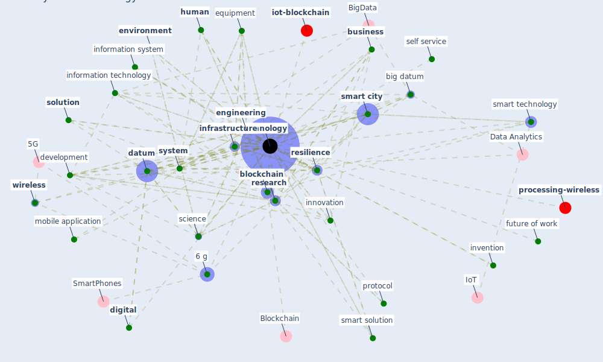

# Keyword: technology

* [datum-iot](cluster_4)

## Keywords

 * [5 g](keyword_5_g), [6 g](keyword_6_g), 6 g wireless communication system, appliance, [architecture](keyword_architecture), [artificial intelligence](keyword_artificial_intelligence), autonomous vehicle, [big datum](keyword_big_datum), black box of technology, [blockchain](keyword_blockchain), [build](keyword_build), [building](keyword_building), [business](keyword_business), caption app, cloud computing, [construction](keyword_construction), construction 4 0, control strategy, [covid-19](keyword_covid-19), [customer](keyword_customer), [datum](keyword_datum), datum science, [detection](keyword_detection), development, [device](keyword_device), [digital](keyword_digital), distance communication, driver, [education](keyword_education), [engineering](keyword_engineering), [environment](keyword_environment), equipment, [filter](keyword_filter), food science, future of work, [human](keyword_human), immune building system, infancy stage, information system, information technology, [infrastructure](keyword_infrastructure), [innovation](keyword_innovation), innovative solution, intelligent transportsystem, interface, [internet](keyword_internet), [internet of thing](keyword_internet_of_thing), invention, [iot](keyword_iot), kitchen, [knowledge](keyword_knowledge), knowledge base, machine learning, migrate online, mobile, mobile application, mobile technology, new frontier, objectivity, office touchpoint, online business, online retailing, online shop, operation, operator, [pandemic](keyword_pandemic), [personalization](keyword_personalization), popularity, position, privacy preservation, [protocol](keyword_protocol), reimagine, remote working, [research](keyword_research), [resilience](keyword_resilience), retail, science, self service, service industry, [smart city](keyword_smart_city), smart smart solution, smart solution, smart technology, smartphone, [solution](keyword_solution), [spread](keyword_spread), [standard](keyword_standard), [sustainable architecture](keyword_sustainable_architecture), [system](keyword_system), [technology](keyword_technology), technology here, technology review, touch versus tech, [uv](keyword_uv), voice control, voice detection, wearable, webshop, what be information technology, wireless

## Mapping

## Neighbours

### Closest articles

* How COVID-19 Could Accelerate the Adoption of New Retail Technologies and Enhance the (E-)Servicescape - [LINK](article_willems_how_2021)
* Future (post-COVID) digital, smart and sustainable cities in the wake of 6G: Digital twins, immersive realities and new urban economies - [LINK](article_allam_future_2021)
* Contributions of Smart City Solutions and Technologies to Resilience against the COVID-19 Pandemic: A Literature Review - [LINK](article_sharifi_contributions_2021)
* Blockchain technology and its applications to combat COVID-19 pandemic - [LINK](article_sharma_blockchain_2022)
* A Comprehensive Review of the COVID-19 Pandemic and the Role of IoT, Drones, AI, Blockchain, and 5G in Managing its Impact - [LINK](article_chamola_comprehensive_2020)
* The three modes of existence of the pandemic smart city - [LINK](article_soderstrom_three_2021)
* Impact of COVID-19 on IoT Adoption in Healthcare, Smart Homes, Smart Buildings, Smart Cities, Transportation and Industrial IoT - [LINK](article_umair_impact_2021)
* World Bank Development Report - [LINK](article_world_bank_world_2022)
* Overcoming the Impact of COVID-19 Using Integrated Project Delivery Model - [LINK](article_g_overcoming_2020)
* How the 5G Enabled the COVID-19 Pandemic Prevention and Control: Materiality, Affordance, and (De-)Spatialization - [LINK](article_li_how_2022)

### Closest BPs

