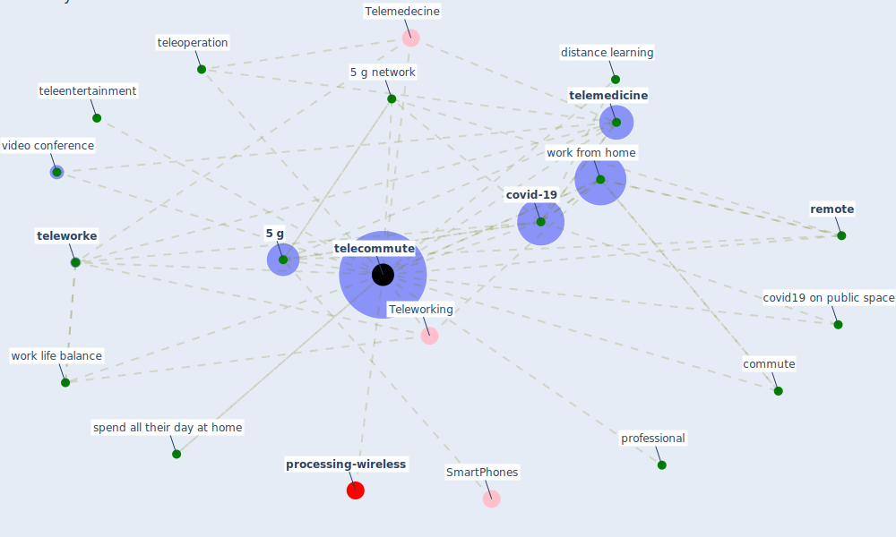

# Keyword: telecommute

* [processing-wireless](cluster_14)

## Keywords

 * [5 g](keyword_5_g), [5 g network](keyword_5_g_network), Cluster_14, Telemedecine, Teleworking, commute, [covid-19](keyword_covid-19), covid19 on public space, distance learning, [professional](keyword_professional), [remote](keyword_remote), spend all their day at home, [telecommute](keyword_telecommute), telecommuting, teleentertainment, [telemedicine](keyword_telemedicine), teleoperation, [teleworke](keyword_teleworke), video conference, work from home, work life balance

## Mapping

## Neighbours

### Closest articles

* Design COVID-19 Ontology: A Healthcare and Safety Perspective - [LINK](article_aloulou_design_2022)
* The Role of Architecture and Urbanism in Preventing Pandemics - [LINK](article_kumar_role_2021)
* How the 5G Enabled the COVID-19 Pandemic Prevention and Control: Materiality, Affordance, and (De-)Spatialization - [LINK](article_li_how_2022)
* Antivirus-built environment: Lessons learned from Covid-19 pandemic - [LINK](article_megahed_antivirus-built_2020)
* COVID-19 and Green Housing: A Review of Relevant Literature - [LINK](article_kaklauskas_covid-19_2021)
* Combating COVID-19—The role of robotics in managing public health and infectious diseases - [LINK](article_yang_combating_2020)
* A Mixed Approach on Resilience of Spanish Dwellings and Households during COVID-19 Lockdown - [LINK](article_cuerdo-vilches_mixed_2020)
* How COVID-19 Redefines the Concept of Sustainability - [LINK](article_hakovirta_how_2020)

### Closest BPs

