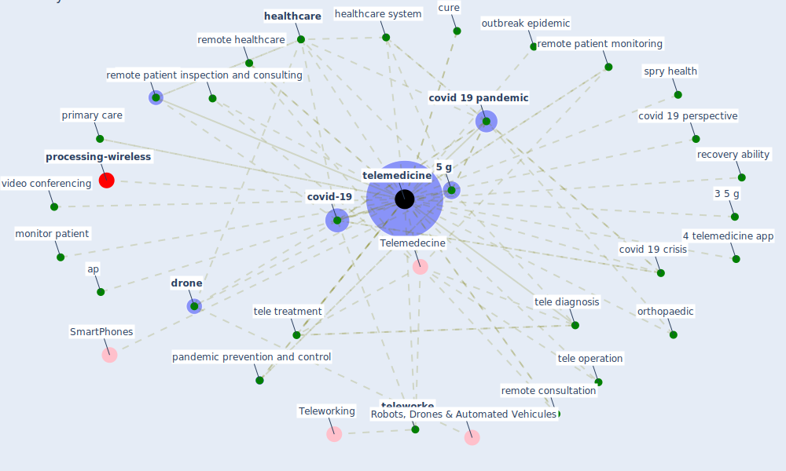

# Keyword: telemedicine

* [processing-wireless](cluster_14)

## Keywords

 * 3 5 g, 4 telemedicine app, [5 g](keyword_5_g), 5 g telemedicine, Cluster_14, Telemedecine, accessibility, amwell, ap, [application](keyword_application), ar, ar base, ar base application, communication technology, consultation, contact trace, coordination, [corona](keyword_corona), covid 19 ap, [covid 19 crisis](keyword_covid_19_crisis), covid 19 outbreak, [covid 19 pandemic](keyword_covid_19_pandemic), covid 19 perspective, [covid-19](keyword_covid-19), cure, [de spatialization](keyword_de_spatialization), [diagnosis](keyword_diagnosis), diagnosis and treatment, diagnosis and treatment technique, diagnosis system, doctor consultation, [drone](keyword_drone), [health care](keyword_health_care), health expert, health management, health sector, [healthcare](keyword_healthcare), healthcare center, healthcare provider, healthcare service, [healthcare system](keyword_healthcare_system), home delivery, [hospital](keyword_hospital), how to treat the disease, information and communication technology, iomt, iomt tech, [monitor](keyword_monitor), monitor patient, online interview, online interview with doctor, orthopaedic, outbreak epidemic, [pandemic](keyword_pandemic), [pandemic prevention and control](keyword_pandemic_prevention_and_control), patient consultation, primary care, recovery ability, remote and flexible working148, remote consultation, remote healthcare, remote patient inspection and consulting, remote patient monitoring, remote treatment, remotely, [smart city](keyword_smart_city), smart healthcare, spry health, t elliott, [technology](keyword_technology), technology feature, teladoc health, tele diagnosis, tele diagnosis tele consultation, tele operation, tele treatment, telecommunication, [telecommute](keyword_telecommute), teleconsultation software, [telehealth](keyword_telehealth), [telemedicine](keyword_telemedicine), telemedicine cart, telemedicine company, telemedicine define, telemedicine resource, teleoperation, telepharmacy, [teleworke](keyword_teleworke), the previous problem, [treatment](keyword_treatment), triage, video conference, video conferencing, wechat

## Mapping

## Neighbours

### Closest articles

* Contributions of Smart City Solutions and Technologies to Resilience against the COVID-19 Pandemic: A Literature Review - [LINK](article_sharifi_contributions_2021)
* Design COVID-19 Ontology: A Healthcare and Safety Perspective - [LINK](article_aloulou_design_2022)
* How the 5G Enabled the COVID-19 Pandemic Prevention and Control: Materiality, Affordance, and (De-)Spatialization - [LINK](article_li_how_2022)
* A Comprehensive Review of the COVID-19 Pandemic and the Role of IoT, Drones, AI, Blockchain, and 5G in Managing its Impact - [LINK](article_chamola_comprehensive_2020)
* Mobile Technology Solution for COVID-19: Surveillance and Prevention - [LINK](article_raza_mobile_2021)
* How COVID-19 Could Accelerate the Adoption of New Retail Technologies and Enhance the (E-)Servicescape - [LINK](article_willems_how_2021)
* The role of 5G for digital healthcare against COVID-19 pandemic: Opportunities and challenges - [LINK](article_siriwardhana_role_2021)
* COVID-19: A new digital dawn? - [LINK](article_robbins_covid-19_2020)
* Leveraging Digital Transformation Technologies to Tackle COVID-19: Proposing a Privacy-First Holistic Framework - [LINK](article_arpaci_leveraging_2021)
* A critical analysis of the impacts of COVID-19 on the global economy and ecosystems and opportunities for circular economy strategies - [LINK](article_ibn-mohammed_critical_2021)

### Closest BPs

