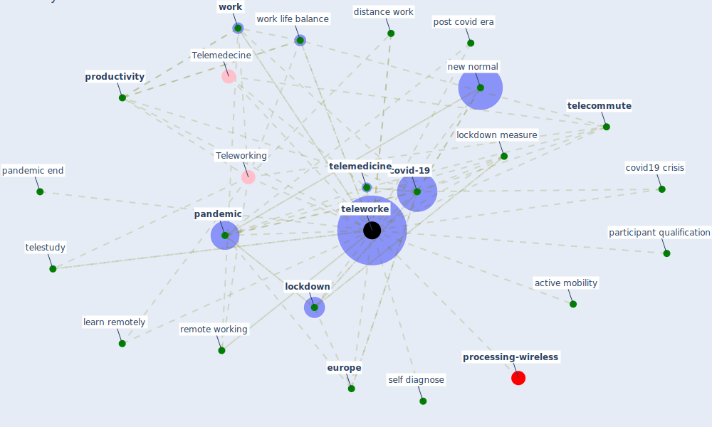

# Keyword: teleworke

* [processing-wireless](cluster_14)

## Keywords

 * Cluster_14, Telemedecine, Teleworking, active mobility, [covid-19](keyword_covid-19), covid19 crisis, distance work, [europe](keyword_europe), learn remotely, [lockdown](keyword_lockdown), lockdown measure, new normal, [pandemic](keyword_pandemic), pandemic end, participant qualification, post covid era, [productivity](keyword_productivity), remote working, self diagnose, [telecommute](keyword_telecommute), [telemedicine](keyword_telemedicine), telestudy, [teleworke](keyword_teleworke), teleworking, [work](keyword_work), work life balance

## Mapping

## Neighbours

### Closest articles

* Contributions of Smart City Solutions and Technologies to Resilience against the COVID-19 Pandemic: A Literature Review - [LINK](article_sharifi_contributions_2021)
* A Mixed Approach on Resilience of Spanish Dwellings and Households during COVID-19 Lockdown - [LINK](article_cuerdo-vilches_mixed_2020)
* 2020 Data Protection Report - [LINK](article_council_of_europe_2020_2020)
* COVID-19 and a new resilient infrastructure landscape - [LINK](article_oecd_covid-19_2021)
* When the fourth water and digital revolution encountered COVID-19 - [LINK](article_poch_when_2020)
* A study on office workplace modification during the COVID-19 pandemic in The Netherlands - [LINK](article_hou_study_2021)
* COVID-19 and Green Housing: A Review of Relevant Literature - [LINK](article_kaklauskas_covid-19_2021)
* Antivirus-built environment: Lessons learned from Covid-19 pandemic - [LINK](article_megahed_antivirus-built_2020)
* COVID-19 Could Leverage a Sustainable Built Environment - [LINK](article_pinheiro_covid-19_2020)

### Closest BPs

